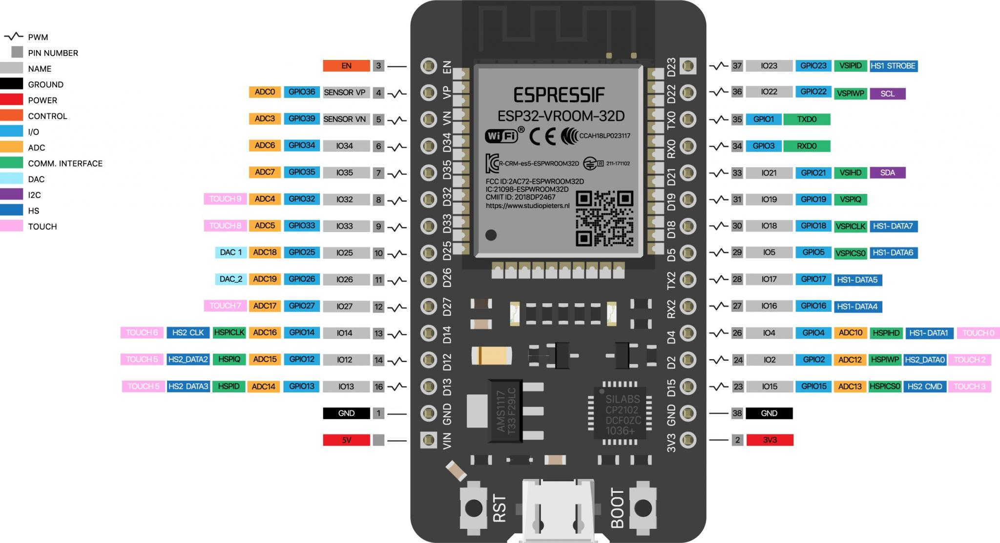

# Definiciones y conceptos generales

## ¿Qué es un sistema embebido?


Un Sistema Embebido es un sistema electrónico diseñado para realizar pocas funciones en tiempo real, al contrario de lo que ocurre con las computadoras, las cuales tienen un propósito general, ya que están diseñadas para cubrir un amplio rango de necesidades, los Sistemas Embebidos se diseñan para cubrir necesidades específicas.

En un Sistema Embebido la mayoría de los componentes se encuentran incluidos en la placa base (la placa de video, audio, módem) y muchas veces los dispositivos resultantes no tienen el aspecto de lo que se suele asociar a una computadora. Algunos ejemplos de Sistemas Embebidos podrían ser dispositivos como un sistema de control de acceso, la electrónica que controla una máquina expendedora o el sistema de control de una fotocopiadora entre otras múltiples aplicaciones.

El Sistema Embebido suele tener en una de sus partes una computadora con características especiales conocida como microcontrolador que viene a ser el cerebro del sistema. Este no es más que un microprocesador que incluye interfaces de entrada/salida en el mismo chip. Normalmente estos sistemas poseen una interfaz externa para efectuar un monitoreo del estado y hacer un diagnóstico del sistema.


## Qué es una placa Arduino? Qué es una placa ESP32?


Este chip, en sus versiones dentro de placas de desarrollo, se ha popularizado muchisimo en toda la comunidad de electrónicos y desarrolladores. Se han desarrollado firmwares, documentación, herramientas y en la actualidad es fácil encontrar tutoriales sobre el mismo y continuamente se publican nuevos artículos.

Por supuesto, los fabricantes están atentos y han desarrollado numerosas placas de desarrollo que integran el ESP32. Cada vez aparecen nuevas opciones, algunas realmente interesantes.

También empiezan a verse artículos y productos comerciales que emplean el ESP32 como núcleo. 

En resumen, es un dispositivo muy interesante, con muchas aplicaciones y muy bajo costo. Tiene un potencial enorme para elaborar todo tipo de proyectos, sobre por su capacidad de comunicación, ocupando un lugar destacado en aplicaciones de IoT.

## Qué es un lenguaje de programación?


Un lenguaje de programación es un conjunto de reglas y sintaxis que permite a los programadores dar instrucciones a una computadora para realizar tareas específicas.

Estos lenguajes actúan como un puente entre los humanos y las máquinas, facilitando la creación de software, aplicaciones y sistemas que ejecutan las instrucciones definidas en el código.

Los lenguajes de programación pueden dividirse en lenguajes de bajo nivel y lenguajes de alto nivel. Los lenguajes de bajo nivel, como el lenguaje de máquina, son directamente entendidos por la computadora, pero son difíciles de escribir y entender para los humanos, ya que se componen de largas cadenas de unos y ceros. Estos lenguajes permiten un control detallado del hardware, pero su complejidad los hace poco prácticos para el desarrollo cotidiano.

Por otro lado, los lenguajes de alto nivel como Python o Java son mucho más cercanos al lenguaje humano, lo que los hace más accesibles y fáciles de aprender. Estos lenguajes permiten escribir código que es traducido a lenguaje de máquina mediante compiladores o intérpretes, facilitando la creación de aplicaciones de manera más rápida y eficiente.


Los lenguajes compilados e interpretados difieren en la forma en que se ejecuta el código. Un compilador toma el código fuente completo y lo convierte en código máquina antes de ejecutarlo, como sucede en lenguajes como _C_ o _C++_.

En cambio, un intérprete lee y ejecuta el código línea por línea, como ocurre en lenguajes como _Python_ o _JavaScript_.

En el caso de los sistemas embebidos, pueden ser programados directamente en el lenguaje ensamblador del microcontrolador o microprocesador o utilizando otros lenguajes como _C_ o _C++_ mediante compiladores específicos


## Qué es un IDE?

Un entorno de desarrollo integrado (IDE) es una aplicación de software que ayuda a los programadores a desarrollar código de software de manera eficiente. Aumenta la productividad de los desarrolladores al combinar capacidades como editar, crear, probar y empaquetar software en una aplicación fácil de usar. Así como los escritores utilizan editores de texto y los contables, hojas de cálculo, los desarrolladores de software utilizan IDE para facilitar su trabajo. En el curso usaremos dos IDEs: **Arduino IDE** y **Visual Studio Code** con una extensión llamada **Platformio IDE**

## Programar con **Arduino IDE**

Ambas placas de desarrollo pueden programarse mediante el software __Arduino IDE__. En el caso de que no lo tengas instalado, visitá el anexo de este sitio web para ver el paso a paso.

### Si queremos programar una placa Arduino...

En la parte de menú tenemos una zona para acceder a funciones como carga de archivos, edición del texto del código, carga de librerías y ejemplos, configuración, herramientas, etc. En los botones de acceso rápido tenemos los siguientes iconos:


 Verifica si tu programa está bien escrito y puede funcionar.

 Carga el programa a la placa de Arduino tras compilarlo.

 Crea un programa nuevo.

 Abre un programa.

 Guarda el programa en el disco duro de la computadora.

 (En la parte derecha de la barra de herramientas se encuentra el Monitor Serial) Abre una ventana de comunicación con la placa Arduino en la que podemos ver las respuestas que nuestro Arduino nos está dando, siempre que tengamos el USB conectado.

En el cuadro del editor de texto escribiremos el código del programa que queramos que Arduino ejecute.

Finalmente, en el área de mensajes y la consola Arduino nos irá dando información sobre si la consola está compilando, cargando y sobre los fallos o errores que se produzcan tanto en el código como en el propio IDE.

El siguiente paso que realizaremos será configurar nuestro IDE para que se comunique con nuestra placa Arduino. Para ello conectaremos nuestro Arduino mediante el cable USB a la PC y después de que el sistema operativo haya reconocido e instalado la tarjeta automáticamente, nos dirigimos a la zona de Menú, pulsamos en Herramientas y después en Tarjeta. Ahí seleccionamos el modelo de tarjeta Arduino que tengamos, en nuestro caso _Arduino UNO_.


Después vamos a la opción Puerto Serial y elegimos el COM en el que tenemos conectado.


Si nos aparecieran varios _COM_ activos, porque estamos usando otros dispositivos serial o por otro motivo, para saber cuál de ellos es el que se comunica con nuestra placa, solo tenemos que ir a Panel de control/Hardware/Administrador de dispositivos. Miramos la pestaña (Puertos _COM y _LPT_) y ahí nos aparecerá nuestro Arduino y el COM en el que está conectado. Con esto, ya podemos empezar a programar nuestro Arduino.

Para finalizar, probaremos que todo está correctamente instalado y configurado ejecutando nuestro primer programa, el más simple, el típico "HELLO WORLD" ("HOLA MUNDO"). Para ello solo tenés que copiar el siguiente código en la zona del editor de texto del _IDE Arduino_:

### Si queremos programar una placa ESP32...

El ESP32 no viene incluido en el IDE de Arduino por defecto, pero podemos agregarlo fácilmente utilizando el “Gestor de tarjetas”. Para esto, seguimos los siguientes pasos:

* Abrir el _Arduino IDE_ e ir a _Archivo > Preferencias_. En el campo _URLs adicionales de gestor de tarjetas_, añade la siguiente URL: **https://espressif.github.io/arduino-esp32/package_esp32_index.json**.
* Luego, vamos a _Herramientas > Placa > Gestor de tarjetas_.
* En el panel que aparece, buscamos _ESP32_ en la barra de búsqueda, y hacemos click en _Instalar_ en el paquete que aparece.
* Una vez completada la instalación, ya podés elegir los modelos de ESP32 en el desplegable, y estarás listo para programar el _ESP32_.

## Programar con **Visual Studio Code + Platformio IDE**

En un inicio, se utilizará el asistente (wizard) para crear un proyecto rápido y fácil.

* Para eso, ir a la pestaña de bienvenida de la extensión PlatformIO definida como: _PIO HOME_, luego hacer click en _crear proyecto_.
* Si no la encontrás, hacer click en el icono de la barra de tareas inferior con forma de _casa_.


* Debes elegir un nombre para tu proyecto en PlatformIO.
* Luego, elegir la placa _Board_ (entre más de 1000 disponibles). Solo ingresa las primeras letras para que el listado se reduzca hasta encontrar la adecuada.
* En la última parte, la opción “framework” se indica automáticamente cuando eliges tu placa, aunque puedes elegir el que prefieras.

El Framework Arduino es un entorno de trabajo que representa el criterio, los conceptos, las buenas prácticas de programación, que se establecen como normas para que sea más fácil el desarrollo.

Un _SDK_ (kit de desarrollo de software) es similar a un framework, pero se orienta al desarrollo con un hardware exclusivo.

Para dar un ejemplo, el NODE MCU ESP8266 puede ser programado con el framework Arduino o con el SDK de Espressif.

Por otro lado, si se verifica la casilla “location”, entonces PlatformIO considera guardar el proyecto en una ubicación por defecto, aunque puedes elegir la que tu quieras.


Una vez que presiones _finish_ el entorno comienza a buscar los archivos de soporte necesario, por ello tendrás que esperar un momento.

Una de las diferencias más grandes con el _IDE Arduino_ o el _IDE Arduino 2.0_ son los archivos que se crean con cada nuevo proyecto y la manera como se organizan. 

En el lateral izquierdo debes elegir el icono _Explorer_. En él, vas a encontrar el proyecto ordenado en carpetas desplegables que creó el asistente de _PlatformIO_. 

Cada carpeta y archivo, lógicamente cumple una tarea. Puede ser un tanto abrumador, aunque lo cierto, es que no es necesario entender cada uno al detalle, por ello, a continuación, verás los más importantes.


1. _Espacio de trabajo_: en «Open Editors» vas a encontrar los archivos que están abiertos, mientras que «workspace» contiene el proyecto en el que estés trabajando actualmente, puedes agregar más de uno y eliminarlos sin problemas.
2. _Directorio del proyecto_: es la carpeta principal que contiene los archivos y subcarpetas que PlatformIO crea automáticamente. Puede haber más de uno según la cantidad de proyectos que se estén gestionando.
3. _Librerías_: en esta carpeta el gestor de librerías de PlatformIO incluye las librerías privadas de cada proyecto.
4. _Código principal_: la carpeta SCR (simboliza la abreviatura de “Source”, fuente en inglés) aquí se incluye el código principal o código fuente de nuestro proyecto.  Por otro lado, PlatformIO crea un fichero con el nombre “main.cpp”. Este es el equivalente al archivo compilado por el IDE Arduino llamado: “codigo.ino”.
5. _platformio.ini_: es un archivo de configuración que dota de funcionalidades extras al entorno. Es capaz de agilizar el trabajo cuando se trata de grandes proyectos.

### Si queremos programar una placa Arduino...

En primer lugar, recurre a la página de bienvenida, luego haz clic en crear proyecto. Debes dar un nombre al proyecto y elegir la placa. Por lo general, se usa el framework Arduino pero tu elige el que desees. 

Para programar un proyecto debes editar el código fuente _main.cpp_


A continuación tenes el código que se utiliza:

```cpp
#include <Arduino.h>

#define pinLED 13

void setup() {
  pinMode(pinLED, OUTPUT);
}
void loop() {
  digitalWrite(pinLED, HIGH); // enciende el LED.
  delay(500); // retardo en milisegundos
  digitalWrite(pinLED, LOW); // apaga el LED.
  delay(500);
}
```
Podes ver que estas simples líneas realizan el parpadeo de un LED. En síntesis, _pinLED_ indica cual es el pin que se va a encender y apagar con un tiempo de espera _delay_ de medio segundo.

Para compilar y verificar si el código no tiene errores presiona el botón inferior con forma de tilde. Luego de un momento, verás el avance del proceso hasta que indique su finalización.


Para subir el código a la placa presiona el siguiente botón. Si no hay ningún problema, deberías ver la señal que indica que tu microcontrolador ya se encuentra con el firmware cargado. Podes notar que no se indicó el puerto a utilizar, gracias a que, PlatformIO lo encuentra automáticamente.


Después de compilar y cargar el código notarás como parpadea el LED incluido en el **Arduino UNO**.

_PlatformIO_ adjunta automáticamente la línea #include _Arduino.h_. Esta sentencia es la encargada de poner a disposición del usuario las funciones principales del entorno _Arduino_, pero recuerda incluirla si creas el proyecto de forma manual.

### Si queremos programar una placa ESP32...

Ahora se realiza el ejemplo usando un ESP32 para parpadear un LED y mostrar un pequeño mensaje en el monitor serial.

* Crear un nuevo proyecto usando el asistente de **PlatformIO**. 
* Recurre a la página de bienvenida, haz clic en crear proyecto. 
* Poné un nombre nuevo al proyecto
* Elige la placa, en este caso se usa el **ESP32 WROOM**. 
* Luego elige el framework a usar, por lo general _Arduino_. 

El código utilizado es el siguiente:

```cpp
#include <Arduino.h>
 
// Se declara la variable LED_PROPIO como una constante en el pin 5

#define LED 5
 
void setup()
{
  // Se inicializa el pin como salida
  pinMode(LED, OUTPUT);
  Serial.begin(19200);
}
 

void loop()
{
  // Enciende el LED
  digitalWrite(LED, HIGH);

  Serial.println("Encendido");
 
  // Retardo de un segundo
  delay(1000);
 
  // Apaga el LED
  digitalWrite(LED, LOW);
  Serial.println("Apagado");
 
   // retardo de un segundo
  delay(1000);
}
```

Para empezar, se declara la variable **LED** como constante. En la parte de configuración **void setup()** se indica el PIN 5 como salida digital y se inicializa el puerto serie en _9600 baudios_. Después, se enciende y apaga el LED con un retardo de 1 segundo. También se envía el mensaje _Encendido_ y _apagado_ por el puerto serie con el mismo retardo. El conexionado del circuito es el siguiente:


Después de verificar, compilar y cargar el código, notarás el típico parpadeo del LED configurado. Para abrir el monitor serie debes presionar el siguiente botón:


Puede SER que la velocidad en baudios del monitor serial no coincida con la velocidad que el ESP32 envía los datos por el puerto serie. Para solucionar el inconveniente debes modificar la velocidad en el archivo _platformio.ini_ en la sentencia **monitor_speed**.


También puede suceder que tengas conectados varios dispositivos al puerto serie. Por eso, procede con las siguientes instrucciones:


1. Elige el puerto correcto según corresponda..
2. En esta parte, verás la información enviada por el ESP32.
3. Esta línea indica cómo interactuar con la terminal de PlatformIO.

Por ejemplo:

**Ctrl+C** sale de la terminal.
**Ctrl+T** permite enviar valores por el monitor serie.
**Ctrl+I** te da información extra de la comunicación.

## Estructura de código

La estructura básica del lenguaje de programación de Arduino es bastante simple y se compone de al menos dos partes. Estas dos partes encierran bloques que contienen declaraciones, estamentos o instrucciones.

En donde _setup()_ es la parte encargada de recoger la configuración y _loop()_ es la que contiene el programa que se ejecutará cíclicamente (de ahí el termino loop _bucle_). Ambas funciones son necesarias para que el programa trabaje.

La estructura _setup()_ debe contener la declaración de las variables. Es la primera función a ejecutar en el programa, se ejecuta sólo una vez, y se utiliza para configurar o inicializar pinMode (modo de trabajo de las E/S), configuración de la comunicación en serie y otras.

La estructura _loop()_ contiene el código que se ejecutará continuamente (lectura de entradas, activación de salidas, etc) Esta función es el núcleo de todos los programas de Arduino y la que realiza la mayor parte del trabajo.

**setup()**
La función _setup()_ se invoca una sola vez cuando el programa empieza. Se utiliza para inicializar los modos de trabajo de los pines, o el puerto serie. Debe ser incluido en un programa, aunque no haya declaración que ejecutar.

**loop()**
Después de llamar a _setup()_, la función _loop()_ hace precisamente lo que sugiere su nombre, se ejecuta de forma cíclica, lo que posibilita que el programa este respondiendo continuamente ante los eventos que se produzcan en la tarjeta.

## Variables y constantes

Programar consiste básicamente en decirle a tu Arduino y a los actuadores que éste controla desde sus puertos (o **shields**) lo que tiene que hacer (o esperamos que haga, todos los programadores saben que estas son cosas frecuentemente diferentes).

Un programa (o _sketch_ en la jerga Arduino) consigue este objetivo fundamentalmente mediante el procesamiento más o menos complejo de datos y la transmisión de estos datos procesados a los actuadores. Lo que llamamos variables es simplemente una manera de codificar o representar estos datos dentro del sketch para facilitar su manipulación de cara a su transmisión hacia o desde los actuadores/sensores.

Desde un punto de vista práctico, podemos considerar las variables como los cajones de un escritorio, cada uno tiene una etiqueta describiendo el contenido y dentro de él se encuentra el valor de la variable (el contenido del cajón). Hay tantos tipos de variables como de datos: números de todo tipo representados de diferentes maneras (enteros, reales, binarios, decimales, hexadecimales, etc.), textos (de un solo o varios caracteres o líneas), matrices (arrays), constantes, etc.

El lenguaje de Arduino maneja los siguientes tipos de variables:


En el lenguaje de Arduino cuando queremos utilizar una variable primero hay que declarar el tipo de variable de la que se trata (por ejemplo _int_ y luego el nombre que le queremos dar a esa variable, **testVariable** en los ejemplos de la tabla anterior).

Podemos dejar la variable sin inicializar (es decir, sin asignarle un valor de partida):

```cpp
int comienzo;
```
O si nos interesa asignarle un valor inicial:

```cpp
int comienzo = 0;
```
Lo más aconsejable es inicializar siempre nuestras variables en el momento de declararlas. Esto nos puede ayudar a depurar nuestros sketches y al mismo tiempo ahorra código.

Veamos el típico sketch que hace parpadear un LED activado a través de un pin:


El uso de variables nos permite reutilizar este código para otro pin con tan sólo cambiar la asignación inicial de la variable **LEDpin**.

No se asusten si no entienden todo en este código. Por el momento alcanza con que comprendan el uso de las variables. Todo lo demás lo iremos viendo en detalle más adelante. Observen que cada instrucción debe de terminarse con un punto y coma (;) de lo contrario el compilador no entendería que la instrucción terminó y nos daría un error.

### ARRAYS

Un **array** es una colección indexada (como un diccionario) de variables del mismo tipo. En el caso de un array el índice no es una palabra como en el diccionario, sino simplemente un número (que corresponde al número de orden de la variable concreta dentro del array). Pueden declarar un array de la siguiente manera:

```cpp
int miLista[6]
```
Si desean inicializarlo al mismo tiempo puedes hacerlo de la siguiente manera:
```cpp
int miLista[6] = {1,2,3,4,5,6};
```

*IMPORTANTE*
Tengan en cuenta que el primer índice de un array es siempre 0 (no 1). Tengan especial cuidado de no acceder a datos fuera del array (por ejemplo en en caso anterior miLista [7] ya que esto nos devolvería datos sin sentido de la memoria.)

#### Ejemplos de operaciones con arrays

```cpp
int minuevaLista[4] ={1,2,3,4} ;
nuevaVariable = minuevaLista[2];
minuevaLista[0] = 986;
nuevaVariable = minuevaLista[0];
```
La primera instrucción crea e inicializa el array con cuatro valores. La segunda crea una nueva variable y le asigna el valor de la tercera variable del array que acabamos de crear (el int 3). La tercera asigna a la primera variable del array el valor entero (int) 986. Por último la cuarta instrucción asigna a la variable que habíamos creado en la segunda línea el valor almacenado en la primera variable del array (986).

#### STRINGS
Un **string** es una cadena (array) de caracteres. Los strings pueden ser declarados de dos maneras diferentes: como variables tipo _char_ o como objetos pertenecientes a una clase más compleja llamados _strings_ de los que hablaremos al final de este capítulo. Por el momento nos ajustamos a las cadenas de caracteres definidas como variables _char_.

#### STRINGS COMO CADENAS O ARRAYS DE CARACTERES

Un array char puede ser declarado de diversas maneras:

```cpp
char polichori[10];
char polichori[8]= {‘C’,’h’,’o’,’r’,’i’,’z’,’o’} ;
char polichori[8]= {‘C’,’h’,’o’,’r’,’i’,’z’,’o’,’\0’} ;
char polichori[]= “Chorizo”;
char polichori[8]= “Chorizo”;
char polichori[10]= “Chorizo”;
```

En la primera línea creamos un array sin inicializar. En la segunda lo dimensionamos e inicializamos y el sistema añade automáticamente un carácter nulo (ASCII 0 ó **\0**) al final del array. En la tercera añadimos el carácter de fin de array explícitamente. En la cuarta línea el array se fracciona en caracteres individuales y se dimensiona automáticamente. En la quinta el array se fracciona automáticamente y en la sexta dejamos espacios libres al final del array para nuevos datos.

### CONSTANTES

Algunas variables no cambian de valor durante la ejecución del sketch. En estos casos podemos añadir la palabra reservada ‘const’ al comienzo de la declaración de la variable. Esto se utiliza típicamente para definir números de pin o constantes matemáticas (**_pi_**, **_e_**, etc).

```cpp
const int NoPinLed = 12;
const float pi = 3.1416;
```
Si tratás de asignar un valor a una constante más adelante en el sketch, el compilador te advertirá de este error mediante un mensaje. El Arduino tiene una serie de palabras reservadas que son constantes:

**_INPUT/OUTPUT (Entrada/Salida)_**: Los pines digitales pueden ser configurados de ambos modos: como entrada (INPUT) o como salida (OUTPUT) mediante la función _pinMode()_: pinMode(13, OUTPUT); // Configura el pin 13 como salida digital.

**_INPUT_PULLUP_**: Reservado como parámetro de la función _pinMode()_ para el uso de resistencias pull-up integradas en el chip _Atmega_ del Arduino.

**_LED_BUILTIN_**: para el uso del Led de serie con el que viene equipado el Arduino (generalmente conectado al pin digital 13).

**_TRUE/FALSE (Verdadero/Falso)_**: Para el Arduino True (Verdadero) es cualquier valor que no es 0. False (Falso) es el valor 0.

**_HIGH/LOW (Alto/Bajo)_**: Es el valor lógico en una puerta digital: LOW es el valor 0 (0 Volts) y HIGH es el valor 1 (5 Volts).

### VARIABLES LOCALES Y GLOBALES

En todos los lenguajes estructurados, como el de Arduino, las variables tienen una propiedad llamada _ámbito_ (_scope_ en inglés). Esta propiedad se refiere al hecho de que el valor de la variable puede ser accedido o no en unas partes del sketch según cómo y dónde esta variable haya sido definida.

Aquellas variables que hayan sido definidas fuera de las funciones setup y loop (veremos que representan estas funciones más tarde cuando hablemos de las funciones y las estructuras) se denominan variables globales y su valor puede ser accedido desde cualquier punto del programa o sketch.

Por el contrario, aquellas variables definidas dentro de una función se llaman variables locales y tienen un ámbito (scope) local: sus valores son accesibles solamente desde adentro de la función en la que han sido declaradas.

El siguiente sketch muestra el uso de variables globales y locales:

```cpp
int pinNoLedGlobal = 12;     (pinNoLedGlobal definida como variable global)
void Setup       {
       pinMode(pinNoLedGlobal, OUTPUT);
}
void loop         {
       int pinNoLedLocal =13;   //pinNoLedLocal definida como variable local dentro de loop        pinMode(pinNoLedLocal, OUTPUT);
       digitalWrite(pinNoLedGlobal, HIGH);
       digitalWrite(pinNoLedLocal, LOW);
}
```

A medida que tus programas (sketches) crecen en tamaño y complejidad, es aconsejable el uso de variables locales porque evita confusiones entre variables con el mismo nombre.

En este punto podés preguntarte que sucede con el ámbito de las variables en el caso de variables declaradas dentro de funciones anidadas (una función llamada desde otra función, que a su vez ha sido llamada desde otra función). Lógicamente, él ámbito de aquellas variables definidas en las funciones exteriores se extiende a las funciones interiores, pero no viceversa.

La siguiente figura ilustra este concepto:


El valor de la variable **_varA_** puede ser accedido desde las funciones **_funciónA_**, **_funciónB_** y **_funciónC_** es decir, es una variable global. En cambio las variables **_varB_** y **_varC_** son variables locales. El valor de la variable **_varB_** sólo puede ser accedido desde las funciones **_funciónB_** y **_funciónC_**, mientras que la variable local **_varC_** sólo puede ser leída desde la función **_funciónC_**.

## Puertos en Arduino

El Arduino, como todo componente, está conformado de distintas partes como son entradas, salidas, alimentación y comunicación.

* **Entradas**: Son los pines de nuestra placa que podemos utilizar para hacer lecturas. En la placa UNO son los pines digitales (del 0 al 13) y los analógicos (del A0 al A5).

* **Salidas**: Los pines de salidas se utilizan para el envío de señales. En este caso los pines de salida son sólo los digitales (0 a 13).

* **Otros pines**: También tenemos otros pines como los _GND_ (tierra), _5V_ que proporciona 5 Volts, _3.3V_ que proporciona 3.3 Volts, los pines _REF_ de referencia de voltaje, _TX_ (transmisión) y _RX_ (lectura) también usados para comunicación serial, _RESET_ para resetear, _Vin_ para alimentar la placa y los pines _ICSP_ para comunicación SPI.

* **Alimentación**: Como hemos visto el pin _Vin_ sirve para alimentar la placa, pero lo más normal es alimentarlo por el _Jack_ de alimentación usando una tensión de 7 a 12 Volts. También podemos alimentarlo por el puerto _USB_ pero en la mayoría de aplicaciones no lo tendremos conectado a una computadora. 

* **Comunicación**: En este curso, la comunicación del Arduino será mediante _USB_ para cargar los programas o enviar/recibir datos. Sin embargo, no es la única forma que tiene Arduino de comunicarse. Cuando insertamos un módulo externo, este se comunica con nuestra placa utilizando los pines _ICSP_ (comunicación ISP), los pines 10 a 13 (también usados para comunicación ISP), los pines TX/RX o cualquiera de los digitales ya que son capaces de configurarse como pines de entrada o salida y recibir o enviar pulsos digitales.


## Puertos en ESP32



* 18 canales de conversión analógico-digital (ADC)
* 10 GPIO de detección capacitiva
* 3 interfaces UART
* 3 interfaces SPI
* 2 interfaces I2C
* 16 canales de salida PWM
* 2 Convertidores de digital a analógico (DAC)
* 2 interfaces I2S

### Pines GPIO

EL ESP32 tiene un total de 25 GPIOs, de los cuales unos pocos pines son pines de entrada solamente.

Pines de sólo entrada: **_GPIO 34, **_GPIO 35, **_GPIO 36 y **_GPIO 39.

No todos los pines tienen pullup de entrada, se necesita un pullup externo en estos pines cuando se usa como pullup de entrada.

Pines con pull up interno INPUT_PULLUP: **_GPIO14_**, **_GPIO16_**, **_GPIO17_**, **_GPIO18_**, **_GPIO19_**, **_GPIO21_**, **_GPIO22_**, **_GPIO23_**.
Los Pines sin pull up interno: **_GPIO13_**, **_GPIO25_**, **_GPIO26_**, **_GPIO27_**, **_GPIO32_**, **_GPIO33_**.

Con Arduino para usar estos pines se pueden usar simplemente comandos comunes

Ejemplo: Para hacer que GPIO22 como entrada y GPIO23 como salida

```cpp
pinMode(22,INPUT_PULLUP);

pinMode(23,OUTPUT);

digitalWrite(23,HIGH);
```

### Pines de entrada analógica

Observa que sólo un subconjunto de pines y funciones de la CAD están expuestos. En primer lugar, los controladores suministrados sólo exponen el **_ADC1_**. La disposición de la placa del ESP32 sólo expone algunos de los pines. En concreto, se exponen los siguientes: **_ADC1_CH0_** , **_ADC1_CH3_** , **_ADC1_CH4_** , **_ADC1_CH5_** , **_ADC1_CH6_** y **_ADC1_CH7_**.

La conversión analógica a digital es la capacidad de leer un nivel de voltaje que se encuentra en una clavija entre 0 y algún valor máximo y convertir ese valor analógico en una representación digital. Variando el voltaje aplicado a la clavija cambiará el valor leído. El ESP32 tiene incorporado un convertidor analógico a digital con una resolución de hasta 12bits, lo que equivale a 4096 valores distintos. Lo que significa que 0 volts producirán un valor digital de 0 mientras que el voltaje máximo producirá un valor digital de 4095 y los rangos de voltaje entre estos producirán un valor digital correspondientemente escalado.

Una de las propiedades de los canales de conversión de analógico a digital es la atenuación. Se trata de un factor de escala de voltaje. Normalmente el rango de entrada es de **_0-1V_** pero con diferentes atenuaciones podemos escalar el voltaje de entrada en este rango. Las escalas disponibles más allá del **_0-1V_** incluyen **_0-1,34V_**, **_0-2V_** y **_0-3,6V_**.

### GPIOs de pulsación capacitiva

El ESP32 tiene 10 sensores táctiles capacitivos internos. Estos pueden detectar variaciones en cualquier cosa que contenga una carga eléctrica, como la piel humana. Así que pueden detectar variaciones inducidas al tocar los GPIOs con un dedo. Estas clavijas pueden ser fácilmente integradas en las almohadillas capacitivas, y reemplazan los botones mecánicos. Los alfileres de contacto capacitivos también pueden ser usados para despertar al ESP32 del sueño profundo.

Esos sensores táctiles internos están conectados a estas GPIOs: **_T0 (GPIO 4)_**, **_T1 (GPIO 0)_**, **_T2 (GPIO 2)_**, **_T3 (GPIO 15)_**, **_T4 (GPIO 13)_**, **_T5 (GPIO 12)_**, **_T6 (GPIO 14)_**, **_T7 (GPIO 27)_**, **_T8 (GPIO 33)_**, **_T9 (GPIO 32)_**

### Convertidor de digital a analógico (DAC)

Hay 2 canales DAC de 8 bits en el ESP32 para convertir las señales digitales en salidas de señales de voltaje analógicas. Estos son los canales DAC: **_DAC1 (GPIO25)_**, **_DAC2 (GPIO26)_**

### RTC GPIOs

Los GPIOs RTC pueden ser usados cuando el ESP32 está en un sueño profundo. Estos GPIOs de RTC pueden usarse para despertar al ESP32 del sueño profundo cuando el coprocesador de ultra baja potencia (ULP) está funcionando. 

Los siguientes GPIOs pueden ser usados como fuente externa de despertar: **_RTC_GPIO0 (GPIO36)_**, **_RTC_GPIO3 (GPIO39)_**, **_RTC_GPIO4(GPIO34)_**, **_RTC_GPIO5(GPIO35)_**, **_RTC_GPIO6 (GPIO25)_**, **_RTC_GPIO7 (GPIO26)_**, **_RTC_GPIO8 (GPIO33)_**, **_RTC_GPIO9 (GPIO32)_**, **_RTC_GPIO10 (GPIO4)_**, **_RTC_GPIO11 (GPIO0)_**, **_RTC_GPIO12 (GPIO2)_**, **_RTC_GPIO13 (GPIO15)_**, **_RTC_GPIO14 (GPIO13)_**, **_RTC_GPIO15 (GPIO12)_**, **_RTC_GPIO16 (GPIO14)_**, **_RTC_GPIO17 (GPIO27)_**.

### PWM

El controlador PWM de LEDs ESP32 tiene 16 canales independientes que pueden ser configurados para generar señales PWM con diferentes propiedades. Todos los pines que pueden actuar como salidas pueden ser utilizados como pines PWM (los pines GPIO 34 a 39 de sólo entrada no pueden generar PWM).

Para configurar una señal PWM, es necesario definir estos parámetros en el código:

* La frecuencia de la señal.
* Ciclo de trabajo.
* Canal PWM.
* GPIO en el que se quiere emitir la señal.

### Puerto Serie

El ESP32 tiene tres puertos seriales:

El primero: RX0 (GPIO3), TX0 (GPIO1) (se utiliza para la  programación). Cuando se programa se llama **_Serial0_**.
El segundo: RX1 (GPIO9), TX1 (GPIO10). Cuando se programa se llama **_Serial1_**.
El tercero: RX2 (GPIO16), TX2 (GPIO17). Cuando se programa se llama **_Serial2_**.

### Protocolo I2C

Cuando se utiliza el ESP32 con el IDE de Arduino, se deben utilizar los pines por defecto del ESP32 I2C (soportados por la biblioteca **_Wire_**): **_GPIO21 (SDA)_**, **_GPIO22 (SCL)_**.

### Interrupciones

Todos los GPIOs pueden ser configurados como interrupciones.

### Enable (EN)

Enable (EN) es el pin de habilitación del regulador de 3.3V. Está levantado, así que conéctalo a tierra para desactivar el regulador de 3,3V. Esto significa que puedes usar esta pin conectado a un pulsador para reiniciar tu ESP32.

### Corriente de GPIO extraída

La corriente máxima absoluta que se extrae por GPIO es de 40 mA actuando como salida y 28 mA como entrada según la hoja de datos del ESP32.

### Instrucciones básicas

**_pinMode(pin, MODE)_**

Esta instrucción es utilizada en la parte de configuración _setup()_ y sirve para configurar el modo de trabajo de un PIN pudiendo ser INPUT (entrada) u OUTPUT (salida).

```cpp
pinMode(pin, OUTPUT); // CONFIGURA pin COMO SALIDA
```
Los pines configurados como OUTPUT (salida) se dice que están en un estado de baja impedancia y pueden proporcionar 40 mA (miliamperes) de corriente a otros dispositivos y circuitos. Esta corriente es suficiente para alimentar un diodo LED (no olvidando poner una resistencia en serie), pero no es lo suficientemente grande como para alimentar cargas de mayor consumo como relés, solenoides, o motores.

Un cortocircuito en los terminales del Arduino o del ESP32 provocará una corriente elevada que puede dañar o destruir el chip Atmega. A menudo es una buena idea conectar en la OUTPUT (salida) una resistencia externa de 470 o de 1000 Ohm.

**_digitalRead(pin)_**

Lee el valor de un pin (definido como digital) dando un resultado HIGH (alto) o LOW (bajo). El pin se puede especificar ya sea como una variable o una constante.

**_digitalWrite(pin, VALUE)_**

Envía al pin definido previamente como OUTPUT el valor HIGH o LOW (poniendo en 1 o 0 la salida). El pin se puede especificar ya sea como una variable o como una constante.

```cpp
digitalWrite(pin, HIGH); // DEPOSITA EN EL pin UN VALOR HIGH (ALTO O 1)
```
El ESP32 es utilizado por muchos fabricantes de placas de desarrollo. Por tanto, el problema es que cada fabricante etiqueta cada pin como le da la gana.

Así que en el ESP32 mi consejo es que siempre llamés a los pines sin alias, simplemente con el número de GPIO.

```cpp
digitalWrite(14, LOW);  // GPIO14
```

**_analogRead(pin)_**

Lee el valor de un determinado pin definido como entrada analógica con una resolución de 10bits para el Arduino y 12bits para el ESP32. Esta instrucción sólo funciona en los pines. El rango de valor que podemos leer oscila de 0 a 1023.

```cpp
valor = analogRead(pin); // ASIGNA A VALOR LO QUE LEE EN LA ENTRADA pin
```

**_analogWrite(pin, value)_**

Esta instrucción funciona únicamente para el Arduino. Las salidas analógicas funcionan bastante diferente en el ESP32. Esto es debido a que el ESP32 tiene varias formas de generar una señal analógica.

En el caso del arduino, esta instrucción sirve para escribir un pseudo-valor analógico utilizando el procedimiento de modulación por ancho de pulso (PWM) a uno de los pines de Arduino marcados como _pin PWM_. El modelo Uno de Arduino, que implementa el chip _ATmega168_, permite habilitar como salidas analógicas tipo PWM los pines 3, 5, 6, 9, 10 y 11. Los modelos de Arduino más antiguos que implementan el chip ATmega8, solo tienen habilitadas para esta función los pines 9, 10 y 11. El valor que se puede enviar a estos pines de salida analógica puede darse en forma de variable o constante, pero siempre con un margen de 0-255.

```cpp
analogWrite(pin, VALOR); // ESCRIBE VALOR EN EL pin DEFINIDO COMO ANALÓGICO
```
Si enviamos el valor 0 genera una salida de 0 voltios en el pin especificado; un valor de 255 genera una salida de 5 voltios en el pin especificado. Para valores de entre 0 y 255, el pin saca tensiones entre 0 y 5 voltios - el valor HIGH de salida equivale a 5v (5 voltios). Teniendo en cuenta el concepto de señal PWM, por ejemplo, un valor de 64 equivaldrá a mantener 0 voltios tres cuartas partes del tiempo y 5 voltios a una cuarta parte del tiempo; un valor de 128 equivaldrá a mantener la salida en 0 la mitad del tiempo y 5 voltios la otra mitad del tiempo, y un valor de 192 equivaldrá a mantener en la salida 0 voltios una cuarta parte del tiempo y de 5 voltios tres cuartas partes del tiempo restante.

Debido a que ésta es una función de hardware, en el pin de salida analógica (PWM) se generará una onda constante después de ejecutada la instrucción analogWrite hasta que se llegue a ejecutar otra instrucción analogWrite (o una llamada a _digitalRead_ o _digitalWrite_ en el mismo pin).

Las salidas analógicas a diferencia de las digitales, no necesitan ser declaradas como INPUT u OUTPUT.

### Funciones de tiempo

Las funciones de tiempo **_millis() y **_micros() funcionan igual que en Arduino.

También funcionan **_delay()_** y **_delayMicroseconds()_**. Sin embargo, _delay_ es no bloqueante, mientras que **_delayMicroseconds_** es bloqueante.

### Yielding

El ESP32 necesita realizar tareas de gestión de la conexión **_WiFi_** y la pila **_TCP/IP_**. Si no las atiende, probablemente se nos va a reiniciar.

Para que todo funcione, necesitamos dejar al ESP32 “respirar”. Para eso, tenemos que llamar a la función yield, que permite al ESP32 atender a sus asuntos internos. Afortunadamente, la función yield se ejecuta en todo delay y al final del loop. Sin embargo, la función **_delaymicroseconds()_** no hace una llamada a **_yield()_**. Por lo que, básicamente, se traduce en que no podés hacer procesos bloqueantes largos (>100ms) o se nos va a reiniciar el ESP32.
* * *
* * *
[Ir al inicio](./index.html)
[Ir al Desarrollo de circuitos](./02_desarrollo_de_circuitos.html)
