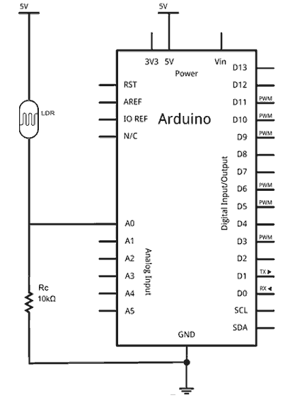

[Inicio](./index.html)

[Definiciones y conceptos generales](./01_def_y_conceptos.html).

[Desarrollo de circuitos](./02_desarrollo_de_circuitos.html)

[Sección circuitos con ESP32](./02b_esp32.html)

[Anexos](./03_anexos.html)

# Desarrollo de circuitos - Arduino

## Puerto serie
Los puertos serie son la forma principal de comunicar una placa Arduino con una PC. Gracias al puerto serie podemos, por ejemplo, mover el mouse o simular la escritura de un usuario en el teclado, enviar emails con alertas, controlar un robot realizando los cálculos en la PC, encender o apagar un dispositivo desde una página Web a través de Internet, o desde una aplicación móvil a través de Bluetooth.

Existen un sin fin de posibilidades en las que se requiere el empleo del puerto serie. Por lo tanto, el puerto serie es un componente fundamental de una gran cantidad de proyectos de Arduino, y es uno de los elementos básicos que debemos aprender para poder sacar todo el potencial de Arduino.

En este capítulo aprenderemos el funcionamiento básico de los puertos serie en Arduino. Al final de la misma se adjuntan varios códigos de ejemplo, pero antes conviene explicar brevemente algo de teoría sobre qué es un puerto serie, y algunos términos que necesitaremos para entender correctamente el funcionamiento del puerto serie.

Un puerto es el nombre genérico con que denominamos a las interfaces, físicas o virtuales, que permiten la comunicación entre dos computadoras o dispositivos.

Un puerto serie envía la información mediante una secuencia de bits. Para ello se necesitan al menos dos conectores para realizar la comunicación de datos, RX (recepción) y TX (transmisión). No obstante, pueden existir otros conductores para referencia de tensión, sincronismo de reloj, etc.

Por el contrario, un puerto paralelo envía la información mediante múltiples canales de forma simultánea. Para ello necesita un número superior de conductores de comunicación, que varían en función del tipo de puerto. Igualmente existe la posibilidad de conductores adicionales además de los de comunicación.


Una computadora convencional dispone de varios puertos serie. Los más conocidos son el popular **_USB_** (_universal serial port_) y el ya casi olvidado **_RS-232_** (el de los antiguos mouse). Sin embargo, dentro del ámbito de la informática y la automatización existen una gran cantidad adicional de tipos de puertos serie, como por ejemplo el **_RS-485_**, **_I2C_**, **_SPI_**, **_Serial Ata_**, **_Pcie Express_**, **_Ethernet_** o **_FireWire_**, entre otros.

En ocasiones podrán ver que se refieren a los puertos serie como **_UART_**. La **_UART_** (_universally asynchronous receiver/transmitter_) es una unidad que incorpora ciertos procesadores, encargada de realizar la conversión de los datos a una secuencia de bits y transmitirlos o recibirlos a una velocidad determinada.

Prácticamente todas las placas Arduino disponen al menos de una unidad UART. Las placas _Arduino UNO_ y _Mini Pro_ disponen de una unidad UART que operan a nivel TTL 0V / 5V, por lo que son directamente compatibles con la conexión USB. Por su parte, Arduino Mega y Arduino Due disponen de 4 unidades UART TTL 0V / 5V.

Los puertos serie están físicamente unidos a distintos pines de la placa Arduino. Lógicamente, mientras usamos los puertos serie no podemos usar como entradas o salidas digitales los pines asociados con el puerto serie en uso.

En Arduino UNO y Mini Pro los pines empleados son 0 (RX) y 1 (TX). En el caso de Arduino Mega y Arduino Due, que tienen cuatro puertos serie, el puerto serie 0 está conectado a los pines 0 (RX) y 1 (TX), el puerto serie 1 a los pines 19 (RX) y 18 (TX) el puerto serie 2 a los pines 17 (RX) y 16 (TX), y el puerto serie 3 a los pines 15 (RX) y 14 (TX).

Muchos modelos de placas Arduino disponen de un conector USB o Micro USB conectado a uno de los puertos serie, lo que simplifica el proceso de conexión con una computadora. Sin embargo algunas placas, como por ejemplo la Mini Pro, prescinden de este conector por lo que la única forma de conectarse a las mismas es directamente a través de los pines correspondientes.

Para realizar la conexión mediante puerto serie únicamente es necesario conectar nuestra placa Arduino utilizando el mismo puerto que usamos para programarlo.

A continuación abrimos el IDE de Arduino y hacemos click en el "Monitor Serial" como se indica en la imagen.


El monitor de puerto serie es una pequeña utilidad integrada dentro de IDE Standard que nos permite enviar y recibir fácilmente información a través del puerto serie. Su uso es muy sencillo, y dispone de dos zonas, una que muestra los datos recibidos, y otra para enviarlos. Estas zonas se muestran en la siguiente imagen.


### CÓDIGOS DE EJEMPLO

#### RECIBIR INFORMACIÓN DESDE EL ARDUINO

En este primer código vamos a recibir el valor de un contador enviado desde la placa Arduino. Este valor se incrementa cada segundo. Podemos observar como se reciben los valores desde del monitor serial.


#### ENVIAR INFORMACIÓN AL ARDUINO

En este ejemplo empleamos el puerto serie para encender o apagar el LED integrado en la placa Arduino. Para ello enviamos un carácter a la placa Arduino, empleando el monitor serial. En caso de enviar _'a'_ la placa Arduino apaga el LED, y en caso de enviar _'b'_ lo enciende.


#### ENVIAR VALORES NUMÉRICOS

Por último, en este ejemplo enviamos un número entre 1 a 9 a través del monitor serial, y la placa Arduino hace parpadear en el LED integrado el número de veces indicado. El código es similar al anterior, pero hay que resaltar que al enviarse los datos caracteres ASCII, debemos restar el valor '0' al dato recibido para recuperar el valor numérico enviado.


## LED


### EJEMPLOS DE CÓDIGO

Así, el siguiente código sirve para encender y apagar un LED:


El siguiente código emplea las salidas digitales y la comunicación por puerto serie para hacer parpadear el LED el número de veces que enviemos por el puerto serie.


## Pulsador

Vamos a trabajar con el LED que viene integrado dentro de la placa de Arduino y que está conectado al pin 13. A continuación veremos el esquema:


El código que se debe cargar en la placa es el siguiente:


La resistencia que hemos utilizado y que debemos utilizar es de 10K ya que así evitamos que tenga influencia sobre el circuito. Cuando el pulsador no está presionado el LED está apagado y cuando está presionado se enciende.

Si lo que queremos es tener el LED siempre encendido y que sólo se apague cuando pulsamos, debemos utilizar la resistencia pull-up. El esquema sería el siguiente:


## Buzzer

Si usamos una de las placas comerciales para pequeños proyectos y hobbies, que incorporan la electrónica y terminales necesarios, la conexión con Arduino es realmente sencilla. Simplemente alimentamos el módulo conectando Vcc y GND a Arduino, y la entrada de señal a cualquier salida digital de Arduino.

El esquema de conexión visto desde el componente sería el siguiente:


Mientras que el esquema de conexión visto desde Arduino quedaría así:


Si queremos usar un altavoz, que consumen mayor corriente de la que puede proporcionar Arduino, tendremos que proporcionar una etapa de amplificación, con un componente llamado transistor. El transistor es como una “compuerta electrónica”, que permite, mediante una señal de baja potencia, controlar el paso de una señal de alta potencia.


### Ejemplos de código

Arduino dispone de dos funciones que nos permiten generar fácilmente señales eléctricas para convertir en sonido, usando cualquiera de las salidas digitales disponibles. Estas funciones son **_tone()_** y **_noTone()_** y, como su nombre indican, permiten generar o detener la señal del tono en un pin.

```cpp
tone(pin, frecuencia); //activa un tono de frecuencia determinada en un pin dado
noTone(pin);           //detiene el tono en el pin
```

La función _tone()_ también permite especificar la duración del sonido generado.

```cpp
tone(pin, frequencia, duracion);  //activa un tono de frecuencia y duracion determinados en un pin dado
```
Pese a su sencillez, al usar las funciones para la generación de tone tenemos que asumir importantes limitaciones.

* La función _Tone()_ emplea el Timer 2, por lo que mientras este funcionando no podremos usar las salidas PWM en los pines 3 y 11 en _Arduino Nano_ y _Arduino Uno_ (pines 9 y 10 en Arduino Mega).
* No podemos usar la función _tone()_ en dos pines de forma simultánea. Deberemos apagar el tono con la funcion _noTone()_ antes de poder usarlo en otro pin.
* Los rangos de la función tone son de 31 Hz a 65535 Hz.

El siguiente código muestra el uso de estas funciones estas funciones en un ejemplo simple, en el que empleamos el buzzer o altavoz conectado en el pin 9 para generar una función de 440Hz durante un segundo, pararlo durante 500ms, y finalmente un tono de 523Hz durante 300ms, para repetir el programa tras una pausa de 500ms.

```cpp
const int pinBuzzer = 9;

void setup() 
{
}

void loop() 
{
  //generar tono de 440Hz durante 1000 ms
  tone(pinBuzzer, 440);
  delay(1000);

  //detener tono durante 500ms  
  noTone(pinBuzzer);
  delay(500);

  //generar tono de 523Hz durante 500ms, y detenerlo durante 500ms.
  tone(pinBuzzer, 523, 300);
  delay(500);
}
```
El siguiente, también muy básico, emplea un array con frecuencias que recorremos secuencialmente para realizar un barrido que aproxima las distintas notas musicales.

```cpp
const int pinBuzzer = 9;

const int tonos[] = {261, 277, 294, 311, 330, 349, 370, 392, 415, 440, 466, 494};
const int countTonos = 10;
   
void setup()
{ 
}

void loop()
{
  for (int iTono = 0; iTono < countTonos; iTono++)
  {
   tone(pinBuzzer, tonos[iTono]);
   delay(1000);
  }
  noTone(pinBuzzer);
}
```

## Potenciometro

El esquema eléctrico es el siguiente:


El montaje necesario se muestra en la siguiente imagen:


El código para leer el desplazamiento del potenciómetro es realmente sencillo. Simplemente usamos una entrada analógica para leer el valor de tensión, y lo transformamos en la posición interpolando con la función **_map_**.


## Sensor LDR o fotorresistor

Un fotorresistor, o **_LDR (light-dependent resistor)_** es un dispositivo cuya resistencia varía en función de la luz recibida. Podemos usar esta variación para medir, a través de las entradas analógicas, una estimación del nivel de la luz.


El esquema eléctrico sería el siguiente:



Por su parte, el montaje eléctrico en una protoboard quedaría de la siguiente manera:


A continuación, tenemos algunos ejemplos de código. En el siguiente, usamos las entradas digitales para hacer parpadear el LED integrado en la placa mientras el LDR recibe luz suficiente.


El siguiente ejemplo emplea una entrada analógica para activar el LED integrado en la placa si supera un cierto umbral (threshold).


El siguiente código proporciona una lectura del nivel de iluminación recibido. Observar que los cálculos se realizan con aritmética de enteros, evitando emplear números de coma flotante, dado que ralentizan mucho la ejecución del código.


## Modulo ultrasónico (US)

En muchos de nuestros proyectos, tenemos la necesidad de sensar nuestro entorno, saber si enfrente hay un obstáculo y a que distancia se encuentra, el sensor **_HC-SR04_** nos permite hacer eso. Vamos a conocer de forma detallada las características del sensor HC-SR04, como calibrar el sensor, como conectarlo y como utilizarlo con Arduino.

El sensor HC-SR04 es un sensor de distancia de bajo costo, su uso es muy frecuente en la robótica, utiliza transductores de ultrasonido para detectar objetos. Su funcionamiento consiste en emitir un sonido ultrasónico por uno de sus transductores, y esperar que el sonido rebote de algún objeto presente, el eco es captado por el segundo transductor. La distancia es proporcional al tiempo que demora en llegar el eco.

Hacer las siguientes conexiones:

- Trigger del sensor al pin 2 del arduino
- Echo del sensor al pin 3 del arduino


### Ejemplo de código

```cpp
const int Trigger = 2;   //Pin digital 2 para el Trigger del sensor
const int Echo = 3;   //Pin digital 3 para el Echo del sensor

void setup() {
  Serial.begin(9600);//iniciailzamos la comunicación
  pinMode(Trigger, OUTPUT); //pin como salida
  pinMode(Echo, INPUT);  //pin como entrada
  digitalWrite(Trigger, LOW);//Inicializamos el pin con 0
}

void loop()
{

  long t; //timepo que demora en llegar el eco
  long d; //distancia en centimetros

  digitalWrite(Trigger, HIGH);
  delayMicroseconds(10);          //Enviamos un pulso de 10us
  digitalWrite(Trigger, LOW);
  
  t = pulseIn(Echo, HIGH); //obtenemos el ancho del pulso
  d = t/59;             //escalamos el tiempo a una distancia en cm
  
  Serial.print("Distancia: ");
  Serial.print(d);      //Enviamos serialmente el valor de la distancia
  Serial.print("cm");
  Serial.println();
  delay(100);          //Hacemos una pausa de 100ms
}

```

## Pantalla LCD + módulo I2C

Aprenderemos a utilizar el Módulo adaptador de LCD a I2C y de esa forma poder controlar nuestro LCD Alfanumérico con solo dos pines de nuestro Arduino.

El protocolo I2C funciona con una arquitectura _maestro-esclavo (master-slave)_. En esta arquitectura existen dos tipos de dispositivos:

* _Maestro (Master)_ o _Controlador (Controller)_: son los que inician y coordinan la comunicación. Usualmente, cuando utilizas un Arduino en un bus I2C este es el rol que cumple.
* _Esclavos (Slave)_ o _Periféricos (Peripheral)_: son los dispositivos que están a la espera de que algún maestro se comunique con ellos. Casos comunes son los sensores y actuadores que soportan este protocolo, aunque también es posible, y en ocasiones necesario, que un microcontrolador se comporte como un esclavo.

El Módulo adaptador LCD a I2C que usaremos está basado en el controlador I2C **_PCF8574_**, el cual es un Expansor de Entradas y Salidas digitales controlado por I2C. Por el diseño del PCB este módulo se usa especialmente para controlar un LCD Alfanumérico.


Para controlar el contraste de los dígitos en el LCD solo necesitamos girar el potenciómetro que se encuentra en el módulo, hasta quedar conformes con el contraste mostrado.

La luz de fondo se controla principalmente por software desde el Arduino, pero el módulo también permite desconectar el Led de la luz de fondo removiendo un jumper LED.


Para conectar con el módulo con el Arduino solo utilizamos los pines I2C del Arduino (SDA y SCL) y alimentación (GND y 5V), los pines I2C varían de acuerdo al modelo de Arduino con el que trabajemos, en la siguiente tabla podemos ver cuales son los pines I2C para cada modelo de Arduino.


### Librería LiquidCrystal_I2C para Arduino

Existen diferentes tipos y versiones de librerías para trabajar con el módulo Adaptador LCD a I2C, información más completa pueden encontrar en: [http://playground.arduino.cc/Code/LCDi2c] (http://playground.arduino.cc/Code/LCDi2c), nosotros usaremos la librería _LiquidCrystal_I2C_.

Las funciones que utiliza esta librería son similares a la librería _LiquidCrystal_ de Arduino, revisaremos las funciones principales:

**_LiquidCrystal_I2C(lcd_Addr, lcd_cols, lcd_rows)_**: Función constructor, crea un objeto de la clase LiquidCrystal_I2C, con dirección, columnas y filas indicadas.

**_init()_**: Inicializa el modulo adaptador LCD a I2C, esta función internamente configura e inicializa el I2C y el LCD.

**_clear()_**: Borra la pantalla LCD y posiciona el cursor en la esquina superior izquierda (posición (0,0)).

**_setCursor(col, row)_**: Posiciona el cursor del LCD en la posición indicada por col y row(x,y); es decir, establecer la ubicación en la que se mostrará posteriormente texto escrito para la pantalla LCD.

**_print()_**: Escribe un texto o mensaje en el LCD, su uso es similar a un Serial.print

**_scrollDisplayLeft()_**: Se desplaza el contenido de la pantalla (texto y el cursor) un espacio hacia la izquierda.

**_scrollDisplayRight()_**: Se desplaza el contenido de la pantalla (texto y el cursor) un espacio a la derecha.

**_backlight()_**: Enciende la Luz del Fondo del LCD

**_noBacklight()_**: Apaga la Luz del Fondo del LCD

### Ejemplos de código

#### ejemplo 1: Un Hola mundo con Arduino y LCD

```cpp
#include <Wire.h> 
#include <LiquidCrystal_I2C.h>

//Crear el objeto lcd  dirección  0x3F y 16 columnas x 2 filas
LiquidCrystal_I2C lcd(0x3F,16,2);  //

void setup() {
  // Inicializar el LCD
  lcd.init();
  
  //Encender la luz de fondo.
  lcd.backlight();
  
  // Escribimos el Mensaje en el LCD.
  lcd.print("Hola Mundo");
}

void loop() {
   // Ubicamos el cursor en la primera posición(columna:0) de la segunda línea(fila:1)
  lcd.setCursor(0, 1);
   // Escribimos el número de segundos trascurridos
  lcd.print(millis()/1000);
  lcd.print(" Segundos");
  delay(100);
}
```

#### ejemplo 2: Desplazando el texto en el LCD

```cpp
#include <Wire.h> 
#include <LiquidCrystal_I2C.h>

//Crear el objeto lcd  dirección  0x3F y 16 columnas x 2 filas
LiquidCrystal_I2C lcd(0x3F,16,2);  //

void setup() {
  // Inicializar el LCD
  lcd.init();
  
  //Encender la luz de fondo.
  lcd.backlight();
  
  // Escribimos el Mensaje en el LCD en una posición  central.
  lcd.setCursor(10, 0);
  lcd.print("WWW.NAYLAMPMECHATRONICS.COM");
  lcd.setCursor(4, 1);
  lcd.print("Tutorial LCD, Test de desplazamiento  ");
}

void loop() {
  //desplazamos una posición a la izquierda
  lcd.scrollDisplayLeft(); 
  delay(500);
}
```

## Barrera infrarroja (IR)

Un detector de obstáculos infrarrojo es un dispositivo que detecta la presencia de un objeto mediante la reflexión que produce en la luz. El uso de luz infrarroja (IR) es simplemente para que esta no sea visible para los humanos.


Este tipo de sensores actúan a distancias cortas, típicamente de 5 a 20mm. Además la cantidad de luz infrarroja recibida depende del color, material, forma y posición del obstáculo, por lo que no disponen de una precisión suficiente para proporcionar una estimación de la distancia al obstáculo.

El montaje es sencillo. Alimentamos el módulo a través de Vcc y GND conectándolos, respectivamente, a la salida de 5V y GND en Arduino.


Opcionalmente, calibramos el umbral de disparo acercando un objeto al detector de obstáculos y regulando la salida digital con el potenciómetro. Si querés saltaros este paso, dejar el potenciómetro en un valor medio.

### Ejemplo de código

```cpp
const int sensorPin = 9;

void setup() {
  Serial.begin(9600);   //iniciar puerto serie
  pinMode(sensorPin , INPUT);  //definir pin como entrada
}
 
void loop(){
  int value = 0;
  value = digitalRead(sensorPin );  //lectura digital de pin
 
  if (value == HIGH) {
      Serial.println("Detectado obstaculo");
  }
  delay(1000);
}
```

## Módulo detector de movimiento (PIR)

Los _sensores infrarrojos pasivos_ (PIR) son dispositivos para la detección de movimiento. Son baratos, pequeños, de baja potencia, y fáciles de usar. Por esta razón son frecuentemente usados en juguetes, aplicaciones domóticas o sistemas de seguridad.

Los sensores PIR se basan en la medición de la radiación infrarroja. Todos los cuerpos (vivos o no) emiten una cierta cantidad de energía infrarroja, mayor cuanto mayor es su temperatura. Los dispositivos PIR disponen de un sensor piro eléctrico capaz de captar esta radiación y convertirla en una señal eléctrica.

En realidad cada sensor está dividido en dos campos y se dispone de un circuito eléctrico que compensa ambas mediciones. Si ambos campos reciben la misma cantidad de infrarrojos la señal eléctrica resultante es nula. Por el contrario, si los dos campos realizan una medición diferente, se genera una señal eléctrica.

De esta forma, si un objeto atraviesa uno de los campos se genera una señal eléctrica diferencial, que es captada por el sensor, y se emite una señal digital.


El otro elemento restante para que todo funcione es la óptica del sensor. Básicamente es una cúpula de plástico formada por lentes de fresnel, que divide el espacio en zonas, y enfoca la radiación infrarroja a cada uno de los campos del PIR.

De esta manera, cada uno de los sensores capta un promedio de la radiación infrarroja del entorno. Cuando un objeto entra en el rango del sensor, alguna de las zonas marcadas por la óptica recibirá una cantidad distinta de radiación, que será captado por uno de los campos del sensor PIR, disparando la alarma.


Este es el esquema de terminales de un sensor PIR:


### Ejemplo de código

```cpp
const int LEDPin= 13;
const int PIRPin= 2;

void setup()
{
  pinMode(LEDPin, OUTPUT);
  pinMode(PIRPin, INPUT);
}

void loop()
{
  int value= digitalRead(PIRPin);
 
  if (value == HIGH)
  {
    digitalWrite(LEDPin, HIGH);
    delay(50);
    digitalWrite(LEDPin, LOW);
    delay(50);
  }
  else
  {
    digitalWrite(LEDPin, LOW);
  }
}
```

## Sensor temperatura DS18B20

El **_DS18B20_** es un sensor de temperatura fabricado por la compañía **_Maxim Integrated_**. Proporciona la salida mediante un bus de comunicación digital que puede ser leído con las entradas digitales de Arduino.

El sensor **_DS18B20_** es un sensor barato y, sin embargo, bastante avanzado. Dispone de un rango amplio de medición de -55ºC a +125ºC y una precisión superior a ±0.5°C en el rango –10°C de +85°C.

Una de las ventajas del DS18B20 es que se comercializa tanto en un integrado TO-92 como en forma de sonda impermeable, lo que permite realizar mediciones de temperatura en líquidos y gases.

El DS18B20 emplea un bus de comunicación denominado 1-Wire propietario de la empresa Maxim Integrated, aunque podemos usarlo sin tener que pagar por ninguna tasa (es parte del precio del dispositivo).


Internamente el sensor DS18B20 es más complicado de lo que en principio podríamos creer. Está formado por un procesador con múltiples módulos, que se encargan de controlar la comunicación, medir la temperatura, y gestionar el sistema de alarmas.

Una de las principales ventajas de DS18B20 es su bus de comunicación 1-Wire que le permite realizar la transmisión empleando únicamente un cable de datos. Para ello, 1-Wire está basado en un complejo sistema de timings en la señal, entre el dispositivo emisor y el receptor.

La mayor desventaja del sistema 1-Wire es que requiere un código complejo, lo que a su vez supone una alta carga del procesador para consultar el estado de los sensores. El tiempo de adquisición total de una medición de 750ms.

Los dispositivos **_1-Wire_** disponen de tres terminales:

* **_Vq_**, la línea de datos
* **_Vdd_**, línea de alimentación
* **_GND_**, línea de tierra


Para poder leer las temperaturas del DS18B20, necesitamos usar la librería **_1-Wire_** y la librería **_Dallas Temperature_**.

### Ejemplo de código

```cpp
#include <OneWire.h>
#include <DallasTemperature.h>

const int oneWirePin = 5;

OneWire oneWireBus(oneWirePin);
DallasTemperature sensor(&oneWireBus);

void setup() {
  Serial.begin(9600);
  sensor.begin(); 
}

void loop() {
    Serial.println("Leyendo temperaturas: ");
  sensor.requestTemperatures();

  Serial.print("Temperatura en sensor 0: ");
  Serial.print(sensor.getTempCByIndex(0));
  Serial.println(" ºC");

  delay(1000); 
}
```

## Comunicación infrarroja (IR)

En este tutorial usaremos un módulo sensor infrarrojo para recibir la señal de controles remotos IR que usan muchos de los equipos domésticos como TVs, equipos de sonidos, etc. A través de estos controlaremos las salidas de nuestro Arduino.

Para este tutorial usaremos el siguiente sensor de Infrarrojos:


Este sensor tiene un filtro interno para detectar solo frecuencias infrarrojos  cercanas a 38KHz, lo que lo hace compatible con la mayoría de mandos infrarrojos, posee 3 pines de conexión GND, VCC y DATA , el cual nos permite conectar directamente a un pin digital de nuestro Arduino o cualquier microcontrolador que deseemos usar.

Como control remoto usaremos uno que viene junto al sensor en el kit:


**_IRremote_** es una de las librerías más usadas y completas para trabajar con protocolos de controles infrarrojos, tiene implementado varios protocolos de las marcas más conocidas como **_Sony_**, **_LG_**, **_Samsung_**, **_Sanyo_**, etc

Pueden descargarlo y encontrar más información en: [https://github.com/z3t0/Arduino-IRremote] https://github.com/z3t0/Arduino-IRremote

Las conexiones son simples el sensor tiene un pin VCC el cual se alimenta con 5V un pin GND y un pin de DATA, que es una salida digital el cual conectaremos al pin 11 del Arduino


### Ejemplos de código

#### ejemplo 1: Encendiendo un led con nuestro control Remoto

```cpp
#include <IRremote.h>

int RECV_PIN = 11;
IRrecv irrecv(RECV_PIN);
decode_results results;

void setup()
{
  irrecv.enableIRIn(); // Empezamos la recepción  por IR
  pinMode(13, OUTPUT);
}

boolean on = LOW;

void loop() {
  if (irrecv.decode(&results)) {
    // Dato recibido, conmutamos el LED
    on = !on;
    digitalWrite(13,  on? HIGH : LOW); 
    irrecv.resume(); // empezamos una nueva recepción
  }
  delay(300);
}
```
Expliquemos un poco el código:

Con  **_IRrecv irrecv(RECV_PIN)_** creamos la variable u objeto para el receptor IR, en el pin especificado, luego creamos la variable **_result_**, que es una estructura en donde se guardaran todos los datos relacionados cuando se recibe un dato por sensor. En **_setup()_** inicializamos la recepción de datos con  **_irrecv.enableIRIn()_** y configuramos el pin 13 como salida.
En el void **_loop()_** simplemente comprobamos si le llega un dato al receptor, esto lo hacemos con **_if(irrecv.decode(&results))_**, si hay un dato, encendemos o apagamos el LED.

Después de cargar el programa, al presionar cualquier tecla de cualquier control remoto, deberá encender o apagar el LED.

#### ejemplo 2: Decodificando datos de los controles infrarrojos

```cpp
#include <IRremote.h>
int RECV_PIN = 11; 

IRrecv irrecv(RECV_PIN);

decode_results results;

void setup()
{
  Serial.begin(9600);
  irrecv.enableIRIn(); // Empezamos la recepción  por IR
}

void loop() {
  if (irrecv.decode(&results)) {
    dump(&results);
    irrecv.resume(); // empezamos una nueva recepción
  }
  delay(300);
}

void dump(decode_results *results) {
  // Dumps out the decode_results structure.
  // Call this after IRrecv::decode()
  
  Serial.print("(");
  Serial.print(results->bits, DEC);
  Serial.print(" bits)");
  
  if (results->decode_type == UNKNOWN) {
    Serial.print("Unknown encoding: ");
  }
  else if (results->decode_type == NEC) {
    Serial.print("Decoded NEC: ");

  }
  else if (results->decode_type == SONY) {
    Serial.print("Decoded SONY: ");
  }
  else if (results->decode_type == RC5) {
    Serial.print("Decoded RC5: ");
  }
  else if (results->decode_type == RC6) {
    Serial.print("Decoded RC6: ");
  }
  else if (results->decode_type == PANASONIC) {
    Serial.print("Decoded PANASONIC - Address: ");
    Serial.print(results->address, HEX);
    Serial.print(" Value: ");
  }
  else if (results->decode_type == LG) {
    Serial.print("Decoded LG ");
  }
  else if (results->decode_type == JVC) {
    Serial.print("Decoded JVC ");
  }
  else if (results->decode_type == AIWA_RC_T501) {
    Serial.print("Decoded AIWA RC T501 ");
  }
  else if (results->decode_type == WHYNTER) {
    Serial.print("Decoded Whynter ");
  }
  Serial.print(results->value, HEX);
  Serial.print(" (HEX) , ");
  Serial.print(results->value, BIN);
  Serial.println(" (BIN)");
}
```

El código anterior envía por el puerto serial los datos correspondientes a la tecla presionada.

## Módulo encoder KY-040

El Módulo KY-040 es un codificador incremental con dos salidas levemente desfasadas, gracias a esto, veremos que se puede saber en que dirección estamos girando el eje.


Un encoder rotativo tiene un número fijo de posiciones por revolución. El KY-40 tiene treinta, estas posiciones son marcadas por clicks conforme se va girando el encoder. Además, posee un pulsador interno.

En los codificadores incrementales (o de cuadratura) como este dispositivo, para saber en qué posición se encuentra, es necesario recurrir al software.

Su funcionamiento es más sencillo de lo que parece: el módulo genera señales digitales sobre los pines A y B. Señales que estarán en nivel alto y que conforme vayamos girando el eje,y en función de hacia qué lado lo giremos, una de esas señales cambiará de estado antes que la otra. Arduino es capaz de detectar estas señales.


Como se puede ver en la figura anterior, partiendo de una señal HIGH, conforme vamos girando el eje, se puede observar en el caso de que giraremos hacia la derecha, cómo primero la salida A cambia a LOW, y la salida B se mantiene en HIGH; en t2, ambas estan en LOW. En t3, la salida A cambia a HIGH y B se mantien en LOW. Esto es lo que nos posibilita determinar el sentido de giro, la posición y la velocidad.

En la imagen inferior, está representado el giro hacia la derecha. A y B son los pines de salida, mientras que C es el común, conectado a un plato dentado. En la primera figura, A y B se encuentran en un nivel HIGH, al rotar el eje del codificador, el pin A hace contacto con C y A pasa a un nivel LOW, mientras que B se mantiene en HIGH.


### Ejemplo de código

```cpp
int A = 2;
int B = 3;

int ANTERIOR = 0;

volatile int POSICION = 0;

void setup() {
  pinMode(A, INPUT);
  pinMode(B, INPUT);
  Serial.begin(9600);
  attachInterrupt(digitalPinToInterrupt(A), codificador, LOW);
}


void loop() {
  if (POSICION != ANTERIOR) {
    Serial.println(POSICION);
    ANTERIOR = POSICION;
  }
}

void codificador()  {
  static unsigned long ultimaInterrupcion = 0;
  unsigned long tiempoInterrupcion = millis();

  if (tiempoInterrupcion - ultimaInterrupcion > 5) {
    if (digitalRead(B) == HIGH){
      POSICION++;
    }else{
      POSICION--;
    }

    POSICION = min(50, max(-50, POSICION));
    ultimaInterrupcion = tiempoInterrupcion;
  }
}
```
## Módulo IMU GY-521 (Aceletrometro + giroscopio + sensor tempratura)

El módulo **_GY-521_** es un acelerómetro y giroscopio que se comunica a través del protocolo I2C, comúnmente utilizado en proyectos de electrónica y robótica para medir la orientación y movimiento de dispositivos. Las características del módulo son las siguientes:

* **_MPU-6050_**: Es el chip principal que integra un acelerómetro y un giroscopio.
* **_Sensor de Temperatura_**: Incluido en el MPU-6050.
* **_Interfaz I2C_**: Utilizada para la comunicación con otros dispositivos, como microcontroladores.
* **_Acelerómetro_**: Mide la aceleración lineal en tres ejes (X, Y, Z).
* **_Giroscopio_**: Mide la velocidad angular en tres ejes (X, Y, Z).
* **_Sensor de Temperatura_**: Mide la temperatura ambiente del chip.
* **_Alimentación_**: Generalmente requiere una alimentación de 3.3V o 5V.
* **_Comunicación_**: Se conecta a través de dos líneas de bus I2C (SDA y SCL).


### Ejemplo de código

```cpp
#include <Wire.h>
#include <MPU6050.h>

MPU6050 mpu;

void setup() {
  // Inicia la comunicación serial para monitorear los datos
  Serial.begin(9600);
  
  // Inicia la comunicación I2C
  Wire.begin();

  // Inicia el MPU-6050
  Serial.println("Iniciando el MPU-6050...");
  mpu.initialize();

  // Verifica si la conexión fue exitosa
  if (mpu.testConnection()) {
    Serial.println("MPU-6050 conectado correctamente");
  } else {
    Serial.println("Error en la conexión del MPU-6050");
  }
}

void loop() {
  // Variables para almacenar los datos del sensor
  int16_t ax, ay, az;
  int16_t gx, gy, gz;

  // Lee los valores del acelerómetro y giroscopio
  mpu.getMotion6(&ax, &ay, &az, &gx, &gy, &gz);

  // Muestra los valores del acelerómetro
  Serial.print("Acelerómetro: ");
  Serial.print("X = "); Serial.print(ax);
  Serial.print(" | Y = "); Serial.print(ay);
  Serial.print(" | Z = "); Serial.println(az);

  // Muestra los valores del giroscopio
  Serial.print("Giroscopio: ");
  Serial.print("X = "); Serial.print(gx);
  Serial.print(" | Y = "); Serial.print(gy);
  Serial.print(" | Z = "); Serial.println(gz);

  // Pausa de 500ms
  delay(500);
}
```
#### Explicación del Código

* **_Wire.begin()_**: Inicia la comunicación I2C entre el Arduino y el GY-521.
* **_mpu.initialize()_**: Configura y activa el MPU-6050.
* **_mpu.getMotion6()_**: Lee los valores del acelerómetro y giroscopio.

Los valores son mostrados en el Monitor Serial de Arduino.

## Módulo RFID RC522

El RFID (Identificador por radiofrecuencia) es un conjunto de tecnologías diseñadas para leer etiquetas (tags) a distancia de forma inalámbrica. Los lectores RFID pueden ser conectados a un autómata o procesador como Arduino.

Las etiquetas RFID están disponibles en una gran variedad de formatos, tales como pegatinas adheribles, tarjetas, llaveros, pueden integrarse en un determinado producto o, incluso, insertarse bajo la piel en un animal o humano.


El lector (transceptor) es en realidad un emisor-receptor que, en primer lugar, emite una señal para iniciar la comunicación con las etiquetas (transpondedores). Esta señal es captada por las etiquetas dentro del alcance, las cuál responden transmitiendo la información almacenada que, finalmente, es captada y decodificada por el lector RFID.

El RFID puede operar en cuatro bandas de frecuencia, siendo la más frecuente 13.56 Mhz.

* Baja frecuencia 125-134.2 kHz. Control de animales, llaves de automóviles…
* Alta frecuencia 13.56 MHz. Control de accesos, control de artículos en tiendas…
* Ultra alta frecuencia (UHF) 868 - 956 GHZ
* Microondas, 2,45 GHz

Existen etiquetas RFID de sólo lectura, es decir, en las que la información que contienen es grabada durante su fabricación y no puede modificarse, y etiquetas de lectura y escritura, en las que podemos sobreeescribir la información de la etiqueta.

Respecto a la alimentación, existen etiquetas RFID activas que disponen de su propia fuente de energía (por ejemplo, una batería). El rango de lectura puede ser de 10m a 100m.

Por contra las etiquetas RFID pasivas obtienen su energía por inducción de la onda electromagnética emitida por el lector. Por tanto, no requieren fuente de alimentación. Sin embargo el alcance de lectura se reduce a unos centímetros.


Para realizar la lectura del RC522 usaremos la librería disponible en este [enlace] (https://github.com/miguelbalboa/rfid)

### Ejemplo de código

#### Ejemplo 1: Mostrar el ID de la tarjeta

El siguiente ejemplo detecta una tarjeta RFID, y muestra su identificador por puerto serie.

```cpp
//RST          D9
//SDA(SS)      D10
//MOSI         D11
//MISO         D12
//SCK          D13

#include <SPI.h>
#include <MFRC522.h>

const int RST_PIN = 9;        // Pin 9 para el reset del RC522
const int SS_PIN = 10;        // Pin 10 para el SS (SDA) del RC522
MFRC522 mfrc522(SS_PIN, RST_PIN);   // Crear instancia del MFRC522

void printArray(byte *buffer, byte bufferSize) {
  for (byte i = 0; i < bufferSize; i++) {
    Serial.print(buffer[i] < 0x10 ? " 0" : " ");
    Serial.print(buffer[i], HEX);
  }
}

void setup()
{
  Serial.begin(9600);    //Inicializa la velocidad de Serial
  SPI.begin();      //Función que inicializa SPI
  mfrc522.PCD_Init();     //Función  que inicializa RFID
}

void loop()
{
  // Detectar tarjeta
  if (mfrc522.PICC_IsNewCardPresent())
  {
    if (mfrc522.PICC_ReadCardSerial())
    {
      Serial.print(F("Card UID:"));
      printArray(mfrc522.uid.uidByte, mfrc522.uid.size);
      Serial.println();

      // Finalizar lectura actual
      mfrc522.PICC_HaltA();
    }
  }
  delay(250);
}
```
#### Ejemplo 2: Validar el ID de la tarjeta

El siguiente ejemplo lee una tarjeta y comprueba el ID para determinar si la tarjeta es aceptada o no.

```cpp
//RST          D9
//SDA(SS)      D10
//MOSI         D11
//MISO         D12
//SCK          D13

#include <SPI.h>
#include <MFRC522.h>

const int RST_PIN = 9;        // Pin 9 para el reset del RC522
const int SS_PIN = 10;        // Pin 10 para el SS (SDA) del RC522
MFRC522 mfrc522(SS_PIN, RST_PIN);   // Crear instancia del MFRC522

byte validKey1[4] = { 0xA0, 0xB1, 0xC2, 0xD3 };  // Ejemplo de clave valida

//Función para comparar dos vectores
bool isEqualArray(byte* arrayA, byte* arrayB, int length)
{
  for (int index = 0; index < length; index++)
  {
    if (arrayA[index] != arrayB[index]) return false;
  }
  return true;
}

void setup() {
  Serial.begin(9600); // Iniciar serial
  SPI.begin();        // Iniciar SPI
  mfrc522.PCD_Init(); // Iniciar MFRC522
}

void loop() {
  // Detectar tarjeta
  if (mfrc522.PICC_IsNewCardPresent())
  {
    //Seleccionamos una tarjeta
    if (mfrc522.PICC_ReadCardSerial())
    {
      // Comparar ID con las claves válidas
      if (isEqualArray(mfrc522.uid.uidByte, validKey1, 4))
        Serial.println("Tarjeta valida");
      else
        Serial.println("Tarjeta invalida");

      // Finalizar lectura actual
      mfrc522.PICC_HaltA();
    }
  }
  delay(250);

}
```
#### Ejemplo 3: Escritura de datos

En el último ejemplo empleamos las funciones de escritura y lectura para grabar una cadena de texto en la memoria de la tarjeta Mifare.

```cpp
//RST          D9
//SDA(SS)      D10
//MOSI         D11
//MISO         D12
//SCK          D13

#include <SPI.h>
#include <MFRC522.h>

const int RST_PIN = 9;
const int SS_PIN = 10;

//Declaracion de cadena de caracteres
unsigned char data[16] = { 'T','E','S','T',' ','R','F','I','D',' ','M','F','R', '5','5','2'}; 
unsigned char *writeData = data; 
unsigned char *str;

MFRC522 mfrc522(SS_PIN, RST_PIN);

MFRC522::MIFARE_Key key;

void printArray(byte *buffer, byte bufferSize) {
  for (byte i = 0; i < bufferSize; i++) {
    Serial.print(buffer[i] < 0x10 ? " 0" : " ");
    Serial.print(buffer[i], HEX);
  }
}

void setup()
{
  Serial.begin(9600);
  SPI.begin();
  mfrc522.PCD_Init();

  for (byte i = 0; i < 6; i++) {
    key.keyByte[i] = 0xFF;
  }
}

void loop()
{
  if (!mfrc522.PICC_IsNewCardPresent())
    return;

  if (!mfrc522.PICC_ReadCardSerial())
    return;

  MFRC522::StatusCode status;
  byte trailerBlock = 7;
  byte sector = 1;
  byte blockAddr = 4;

  status = (MFRC522::StatusCode) mfrc522.PCD_Authenticate(MFRC522::PICC_CMD_MF_AUTH_KEY_A, trailerBlock, &key, &(mfrc522.uid));
  if (status != MFRC522::STATUS_OK) {
    Serial.print(F("PCD_Authenticate() failed: "));
    Serial.println(mfrc522.GetStatusCodeName(status));
    return;
  }

  // Write data to the block
  Serial.print(F("Escribir datos en sector "));
  Serial.print(blockAddr);
  Serial.println(F(" ..."));
  printArray((byte*)data, 16); Serial.println();
  status = (MFRC522::StatusCode) mfrc522.MIFARE_Write(blockAddr, (byte*)data, 16);
  if (status != MFRC522::STATUS_OK) {
    Serial.print(F("MIFARE_Write() failed: "));
    Serial.println(mfrc522.GetStatusCodeName(status));
  }
  Serial.println();

  byte buffer[18];
  byte size = sizeof(buffer);

  // Read data from the block (again, should now be what we have written)
  Serial.print(F("Leer datos del sector ")); Serial.print(blockAddr);
  Serial.println(F(" ..."));
  status = (MFRC522::StatusCode) mfrc522.MIFARE_Read(blockAddr, buffer, &size);
  if (status != MFRC522::STATUS_OK) {
    Serial.print(F("MIFARE_Read() failed: "));
    Serial.println(mfrc522.GetStatusCodeName(status));
  }
  Serial.print(F("Data in block ")); Serial.print(blockAddr); Serial.println(F(":"));
  printArray(buffer, 16); Serial.println();

  // Halt PICC
  mfrc522.PICC_HaltA();
  // Stop encryption on PCD
  mfrc522.PCD_StopCrypto1();
}
```

## Módulo temperatura y humedad DHT11 y DHT22

Los sensores **_DHT11_** y **_DHT22_** son sensores digitales de Temperatura y Humedad, fáciles de implementar con cualquier microcontrolador. Utiliza un sensor capacitivo de humedad y un termistor para medir el aire circundante y solo un pin para la lectura de los datos. Tal vez la desventaja de estos es la velocidad de las lecturas y  el tiempo que hay que esperar para tomar nuevas lecturas (nueva lectura después de 2 segundos), pero esto no es tan importante puesto que la Temperatura y Humedad son variables que no cambian muy rápido en el tiempo.


El sensor DHT11 trabaja con un rango de medición de temperatura de 0 a 50°C con precisión de ±2.0°C y un rango de humedad de 20% a 90% RH con precisión de 4% RH. Los ciclos de lectura deben ser como mínimo 1 o 2 segundos. En el caso del DHT22, el rango de medición de temperatura es de -40°C a 80 °C con precisión de ±0.5°C y rango de humedad de 0 a 100% RH con precisión de 2% RH, el tiempo entre lecturas debe ser de 2 segundos.


La resistencia Pull-Up puede ser una valor entre 4.7K y 10K.

Si se desea trabajar con lógica de 3.3v solo hay que cambiar la alimentación a dicho voltaje al igual que la resistencia pull-up debe ir a 3.3V, en nuestro caso vamos a trabajar con el pin digital 2, pero pueden usar otro pin si lo desean.

Usaremos la librería del siguiente link. Con esta librería podemos realizar fácilmente la lectura de ambos sensores y no preocuparnos por el protocolo de comunicación entre Arduino y los sensores.

### Ejemplo de código

#### Ejemplo 1: Lectura de humedad y temperatura con Arduino

Realizar la lectura del sensor es simple, el siguiente ejemplo muestra como leer la humedad, temperatura en Celsius y en Fahrenheit.

```cpp
#include "DHT.h"

#define DHTPIN 2     // Pin donde está conectado el sensor

//#define DHTTYPE DHT11   // Descomentar si se usa el DHT 11
#define DHTTYPE DHT22   // Sensor DHT22

DHT dht(DHTPIN, DHTTYPE);

void setup() {
  Serial.begin(9600);
  Serial.println("Iniciando...");
  dht.begin();
}
void loop() {
  delay(2000);
  float h = dht.readHumidity(); //Leemos la Humedad
  float t = dht.readTemperature(); //Leemos la temperatura en grados Celsius
  float f = dht.readTemperature(true); //Leemos la temperatura en grados Fahrenheit
  //--------Enviamos las lecturas por el puerto serial-------------
  Serial.print("Humedad ");
  Serial.print(h);
  Serial.print(" %t");
  Serial.print("Temperatura: ");
  Serial.print(t);
  Serial.print(" *C ");
  Serial.print(f);
  Serial.println(" *F");
}
```

#### ejemplo 2: Incorporando el DHT11/DHT22 en procesos rápidos

Un problema muy común es que al hora de incluir el ejemplo anterior a nuestro proyecto debido a la pausa de los 2 segundos, todo nuestro proyecto también se vuelve lento, incluso podría afectar algunas funcionalidad de nuestro proyecto. Esto porque cada bucle demoraría 2 segundos, tiempo demasiado grande para algunos procesos.

La solución es usar la función **_millis()_** de Arduino, el cual nos da el tiempo en milisegundos desde que empieza a ejecutarse el código.

A continuación se muestra como incorporar el sensor a nuestro proyecto sin necesidad de hacer la pausa de 2 segundos.

```cpp
#include "DHT.h"

#define DHTPIN 2     // Pin donde está conectado el sensor

//#define DHTTYPE DHT11   // Descomentar si se usa el DHT 11
#define DHTTYPE DHT22   // Sensor DHT22

DHT dht(DHTPIN, DHTTYPE);

void setup() {
  Serial.begin(9600);
  Serial.println("Iniciando...");
  dht.begin();
  pinMode(13, OUTPUT);
}
long tiempoUltimaLectura=0;; //Para guardar el tiempo de la última lectura
void loop() {
  //---------Lectura del Sensor--------------------------
  if(millis()-tiempoUltimaLectura>2000)
  {    
      float h = dht.readHumidity(); //Leemos la Humedad
      float t = dht.readTemperature(); //Leemos la temperatura en grados Celsius
      float f = dht.readTemperature(true); //Leemos la temperatura en grados Fahrenheit
      //--------Enviamos las lecturas por el puerto serial-------------
      Serial.print("Humedad ");
      Serial.print(h);
      Serial.print(" %t");
      Serial.print("Temperatura: ");
      Serial.print(t);
      Serial.print(" *C ");
      Serial.print(f);
      Serial.println(" *F");
      tiempoUltimaLectura=millis(); //actualizamos el tiempo de la última lectura
  }
  //----Fin de la lectura---------------------------
  
  //---------Resto del código  del proyecto--------
  //...
  //...
  //...
  digitalWrite(13, HIGH); 
  delay(100);              
  digitalWrite(13, LOW);    
  delay(100);   
  //-------------------------------

}
```

De esta forma evitamos la pausa de los 2 segundos, pero no el tiempo que demora en hacer la lectura, que es de aproximadamente  250 milisegundos, el cual lo pueden notar si realizan el ejemplo anterior, en donde se hace parpadear el led interno de la placa (Pin 13) con pausas de 100ms, pero si observan el led, en el momento de hacer la lectura se nota claramente que el led se apaga por más tiempo durante la lectura del sensor.


* * *
* * *
[Ir al Desarrollo de circuitos](./02_desarrollo_de_circuitos.html)

[Ir a Anexos](./03_anexos.html)