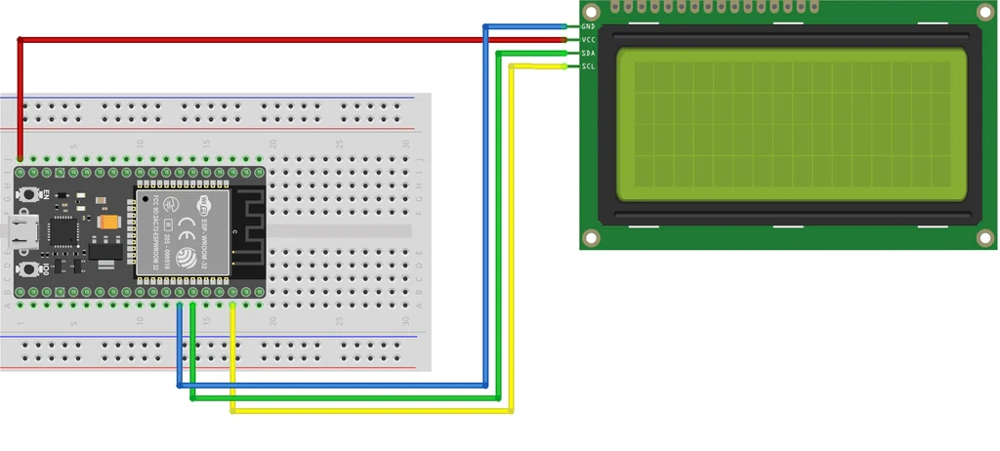

[Inicio](./index.html)

[Definiciones y conceptos generales](./01_def_y_conceptos.html).

[Desarrollo de circuitos](./02_desarrollo_de_circuitos.html)

[Sección circuitos con Arduino](./02a_arduino.html)

[Anexos](./03_anexos.html)

# Desarrollo de circuitos - ESP32

## Puerto serie

El ESP32 dispone de tres puertos serie (también conocido como UART). Estos puertos se llaman UART0, UART1 y UART2. Cada uno de ellos puede usar cuatro pines, RX, TX, CTS y RTS (pero el entorno de Arduino solo usa RX y TX).

Otra diferencia del ESP32 frente a un Arduino convencional es que, gracias a su multiplexor, podemos reasignar los UART a cualquier pin sin pérdida de rendimiento.

Los UART vienen pre configurados para usar ciertos pines. Pero podemos (y en ocasiones debemos), cambiar los pines. Estas son las asignaciones por defecto para el ESP32:


Como vemos, el UART1 los pines TX y RX coinciden con los usados para conectar la memoria SPI Flash. Por lo que si queremos usar el UART, obligatoriamente tendremos que reasignar los pines.

Usar el UART del ESP32 en el entorno de Arduino no es demasiado complicado (si tenemos claro lo que estamos haciendo). Básicamente tenemos disponibles las mismas funciones que tendríamos en cualquier Arduino, como print(), println(), read(), available() y otras para enviar y recibir datos.

```
Serial.println("¡Hola, UART!");
```
El único inconveniente que vas a tener es el de los pines del UART1 y UART2. Con afán de hacerlo más sencillo, igual que se hace en el Arduino Mega, el Core del ESP32 para Arduino define tres UART como Serial, Serial1 y Serial2.

El Serial “normal” es un alias para el UART0 y va a funcionar sin problemas. Es usado para la programación y comunicación por el USB de la placa (con lo cuál, cambiarle los pines no es ni necesario, ni buena idea).

La cosa cambia en los Serial1 y Serial2. Dependiendo de nuestro modelo de ESP32 y nuestra placa, lo normal es que las sintaxis Serial1 y Serial 2 no funcionen.

Lo mejor que podés hacer si querés usar más de un UART es definir a mano los pines. De hecho, a mi ni se me ocurriría usar el UART1 o UART2 sin especificar yo con qué pines está asociado. La buena noticia es que es muy sencillo asociarlos. Para eso necesitamos la biblioteca HardwareSerial, que son “el cerebro” de lo que llamamos ‘Serial’ en Arduino.

Los pasos necesarios son

* Incluir la librería
* Definir un nuevo HardwareSerial
* Inicializarlo con begin(...)

### Ejemplos de código

```cpp
include <HardwareSerial.h>

HardwareSerial MySerial(1); // definir un Serial para UART1
const int MySerialRX = 16;
const int MySerialTX = 17;

void setup() 
{
	// inicializar el Serial a los pines
    MySerial.begin(11500, SERIAL_8N1, MySerialRX, MySerialTX);
}

void loop() 
{
	// aqui podríamos usar nuestro MySerial con normalidad
    while (MySerial.available() > 0) {
        uint8_t byteFromSerial = MySerial.read();
        //y lo que sea
    }
   
    MySerial.write(...);
}
```

## LED

Como se muestra en la imagen, conectaremos el pin digital D2 del ESP32 al ánodo (+) del led mientras el cátodo se conecta a una resistencia de 330 ohms y después a la tierra (GND) del ESP32.


### Ejemplo de código

```cpp
//Declaramos el pin que encendera
int pin_dos = 2;
//Iniciamos los pines del ESP32
void setup() {
  //Declaramos que el pin del led es de tipo salida, osea que la señal va salir
  pinMode(pin_dos, OUTPUT);
}
//Iniciamos la funcion bucle que se repetira indefinidamente
void loop() {
  //Encendemos el led
  digitalWrite(pin_dos, HIGH);
  //Esperamos un segundo
  delay(1000);
  //Apagamos el led
  digitalWrite(pin_dos, LOW);
  //Esperamos un segundo
  delay(1000);
}
```
#### Explicación del código

* Declaramos el pin 2 que encenderá y se apagara.
* Declaramos que el pin del led es de tipo salida, o sea que la señal va a salir.
* Iniciamos la función bucle que se repetirá indefinidamente
* Encendemos el led
* Esperamos un segundo
* Apagamos el led
* Esperamos un segundo
* Repetimos el ciclo

## Pulsador

* Conectaremos el pin digital D2 del ESP32 al ánodo (+) del led mientras el cátodo se conecta a una resistencia de 330 ohms y después a la tierra (GND) del ESP32.
* En una pata del pulsador lo conectamos a una resistencia de 330 ohms y de ahí a la tierra (pull down), además lo conectamos al pin D4.
* En la otra pata la mandamos a 3.3v para que al presionar enviemos corriente circule una corriente de 3v hacia el pin 4 y se mande una señal positiva.


Este código recibe la señal del pin 4 que es la señal recibida del pulsador, despues tenemos unas condicionales que estan al pendiente del estado del pin del pulsador para encender o apagar el led.

### Ejemplo de código

```cpp
// Declaramos el pin al que estará conectado el pulsador
int pinPulsador = 4;
// Declaramos el pin al que estará conectado el led
int pinLed = 2;

void setup()
{
  //Determinamos que el pin del pulsador sera para recibir 
  pinMode(pinPulsador, INPUT);
  //Determinamos que el pin del led sera para salir
  pinMode(pinLed, OUTPUT);
}

void loop()
{
  //Si la señal del pulsador es activa encendemos el led
  if (digitalRead(pinPulsador) == HIGH) {
    digitalWrite(pinLed, HIGH);
  } 
  //de lo contrario apagamos el led
  else {
    digitalWrite(pinLed, LOW);
  }
  delay(10);
}
```

#### Explicación del código

* Declaramos el pin al que estará conectado el pulsador.
* Declaramos el pin al que estará conectado el led.
* Determinamos que el pin del pulsador sera para recibir.
* Determinamos que el pin del led sera para salir.
* Si la señal del pulsador es activa encendemos el led, de lo contrario apagamos el led.

## Potenciómetro

Leeremos el valor de un potenciometro. Aclaremos que el potenciómetro nos va a entregar una entrada de 0 a 4095.


### Ejemplo de código

```cpp
// Declaramos la intensidad del brillo
int BRILLO = 0;
// Pin de entrada del potenciometro
int pinPot=34;
// Pin de salida al led
int pinLed=2;
//Características del PWM
const int frecuencia = 1000;
const int canal = 0;
const int resolucion = 10;

void setup()
{
  Serial.begin(9600);
  //Inicializamos las características del pwm
  ledcSetup(canal, frecuencia, resolucion);
  // Definimos que el pin 2 sacara el voltaje
  ledcAttachPin(pinLed, OUTPUT);
  delay(1000);
}
void loop()
{
  //Obtenemos la señal del potenciometro
  BRILLO = analogRead(pinPot);
  //Mostramos la señal del potenciometro
  Serial.println(BRILLO);
  //desde 0 a 4095
}
```

## PWM

Ahora que ya sabemos encender un led vamos a aprender a trabajar con **_PWM_**, el cual es el acrónimo de **_Pulse Width Modulation_** (Modulación por ancho de pulso). 

Supongamos que debemos encender un led de 5 Volts con una intensidad lumínica variable, pero al 50% de su capacidad, pero, solo podemos enviar o 0 Volts o 5 Volts (o sea no podemos enviar 2.5 Volts). Pues ahí entra el PWM porque vamos a jugar con el tiempo y el voltaje enviando la mitad del tiempo 5 Volts y la otra mitad del tiempo 0 Volts generando un efecto de medio encendido como se muestra en este diagrama:


Mientras más tiempo se manden 5 Volts más fuerte enciende el led y viceversa entre menos tiempo se manden 5 Volts menor es la intensidad.


### Ejemplo de código

```cpp
// Declaramos la intensidad del brillo del led
int brillo = 0;
// Declaramos el pin que enviara el voltaje
int pinLed=2;
//Características del PWM
const int frecuencia = 1000;
const int canal = 0;
const int resolucion = 10;
void setup()
{
  //Inicializamos las características del pwm
  ledcSetup(canal, frecuencia, resolucion);
  // Definimos que el pin 2 sacara el voltaje
  ledcAttachPin(pinLed, OUTPUT);
}
void loop()
{
  // Incrementamos el brillo de 0 a 256
  for (brillo = 0; brillo <= 256; brillo += 1) {
    //Encendemos el pinLed con la intensidad del brillo
    ledcWrite(pinLed, brillo);
    //Esperamos 15 milisegundos
    delay(15); 
  }
  // Decrementamos el brillo de 0 a 256
  for (brillo = 256; brillo >= 0; brillo -= 1) {
    //Encendemos el pinLed con la intensidad del brillo
    ledcWrite(pinLed, brillo);
    //Esperamos 15 milisegundos
    delay(15); 
  }
}
```

### LED + potenciometro

Ahora que sabemos encender un led con ESP32 vamos a encender el ESP32 con un potenciómetro y de una forma parecida al ESP32 PWM led aumentaremos y disminuiremos la intensidad del led.

Para entender más en detalle vamos a crear un código que encienda el led con una intensidad de 0 y que aumente poco a poco 256 usando el potenciómetro. Aclaremos que el potenciómetro nos va a entregar una entrada de 0 a 4095, pero como vimos en el tutorial ESP32 PWM led los leds en PWM reciben un valor desde 0 a 256, así que vamos a tener que dividir 4095/16 para convertirlo de 4095 a 256.


### Ejemplo de código

```cpp
// Declaramos la intensidad del brillo
int BRILLO = 0;
// Pin de entrada del potenciometro
int pinPot=34;
// Pin de salida al led
int pinLed=2;
//Características del PWM
const int frecuencia = 1000;
const int canal = 0;
const int resolucion = 10;

void setup()
{
  Serial.begin(9600);
  //Inicializamos las características del pwm
  ledcSetup(canal, frecuencia, resolucion);
  // Definimos que el pin 2 sacara el voltaje
  ledcAttachPin(pinLed, OUTPUT);
  delay(1000);
}

void loop()
{
  //Obtenemos la señal del potenciometro
  BRILLO = analogRead(pinPot);
  //Mostramos la señal del potenciometro
  Serial.println(BRILLO);
  //desde 0 a 4095
  //Dividimos la señal en entre 16
  BRILLO = (BRILLO / 16.2);
  Serial.println(BRILLO);
  //Encendemos el led
  //ledcWrite(pinLed, BRILLO);
  analogWrite(pinLed, BRILLO);
  delay(1000);
}
```

## Sensor ultrasonico HC-04

En este tutorial vamos a detectar la proximidad con un sensor de distancia HC-SR04. Su funcionamiento es muy sencillo. El sensor ultrasónico emite un sonido ultrasónico y recibe el sonido restando el tiempo que tardo entre emitirse y recibirse calculando la distancia.


### Ejemplo de código

```cpp
const int trig_pin = 5;
const int echo_pin = 18;

// Sound speed in air
#define SOUND_SPEED 340
#define TRIG_PULSE_DURATION_US 10


long ultrason_duration;
float distance_cm;

void setup() {
  Serial.begin(115200);
  pinMode(trig_pin, OUTPUT); // We configure the trig as output
  pinMode(echo_pin, INPUT); // We configure the echo as input
}

void loop() {
  // Set up the signal
  digitalWrite(trig_pin, LOW);
  delayMicroseconds(2);
 // Create a 10 µs impulse
  digitalWrite(trig_pin, HIGH);
  delayMicroseconds(TRIG_PULSE_DURATION_US);
  digitalWrite(trig_pin, LOW);

  // Return the wave propagation time (in µs)
  ultrason_duration = pulseIn(echo_pin, HIGH);

//distance calculation
  distance_cm = ultrason_duration * SOUND_SPEED/2 * 0.0001;

  // We print the distance on the serial port
  Serial.print("Distance (cm): ");
  Serial.println(distance_cm);

  delay(1000);
}
```

## Sensor de temperatura DHT11 y DHT22

Este ejemplo sirve tanto para el DHT11 como para el DHT22. Armamos el siguiente esquema:


#### Instalar librerías:

* Click en _programa_.
* Seleccionamos _librería_.
* Click en _Administrador de bibliotecas_.


Buscamos _DHT sensor library for ESPx_ y damos click en instalar


### Ejemplo de código

```cpp
//Incluimos las librerias
#include "DHTesp.h"
//Decaramos el variable que almacena el pin a conectar el DHT11
int pinDHT = 15;
//Instanciamos el DHT
DHTesp dht;
void setup() {
  Serial.begin(115200);
  //Inicializamos el dht
  dht.setup(pinDHT, DHTesp::DHT22);
}
void loop() {
  //Obtenemos el arreglo de datos (humedad y temperatura)
  TempAndHumidity data = dht.getTempAndHumidity();
  //Mostramos los datos de la temperatura y humedad
  Serial.println("Temperatura: " + String(data.temperature, 2) + "°C");
  Serial.println("Humedad: " + String(data.humidity, 1) + "%");
  Serial.println("---");
  delay(1000);
}
```

## Buzzer

En este tutorial vamos a tocar la canción de Halloween en ESP32 usando solo nuestro Dispositivo ESP32 y un Buzzer (en ingles) o Zumbador siguiendo estos pasos. Armamos el siguiente circuito:


### Ejemplo de código

```cpp
/*
parcelas.h
Canción de Halloween en ESP32
*/
#define NOTE_B0  31
#define NOTE_C1  33
#define NOTE_CS1 35
#define NOTE_D1  37
#define NOTE_DS1 39
#define NOTE_E1  41
#define NOTE_F1  44
#define NOTE_FS1 46
#define NOTE_G1  49
#define NOTE_GS1 52
#define NOTE_A1  55
#define NOTE_AS1 58
#define NOTE_B1  62
#define NOTE_C2  65
#define NOTE_CS2 69
#define NOTE_D2  73
#define NOTE_DS2 78
#define NOTE_E2  82
#define NOTE_F2  87
#define NOTE_FS2 93
#define NOTE_G2  98
#define NOTE_GS2 104
#define NOTE_A2  110
#define NOTE_AS2 117
#define NOTE_B2  123
#define NOTE_C3  131
#define NOTE_CS3 139
#define NOTE_D3  147
#define NOTE_DS3 156
#define NOTE_E3  165
#define NOTE_F3  175
#define NOTE_FS3 185
#define NOTE_G3  196
#define NOTE_GS3 208
#define NOTE_A3  220
#define NOTE_AS3 233
#define NOTE_B3  247
#define NOTE_C4  262
#define NOTE_CS4 277
#define NOTE_D4  294
#define NOTE_DS4 311
#define NOTE_E4  330
#define NOTE_F4  349
#define NOTE_FS4 370
#define NOTE_G4  392
#define NOTE_GS4 415
#define NOTE_A4  440
#define NOTE_AS4 466
#define NOTE_B4  494
#define NOTE_C5  523
#define NOTE_CS5 554
#define NOTE_D5  587
#define NOTE_DS5 622
#define NOTE_E5  659
#define NOTE_F5  698
#define NOTE_FS5 740
#define NOTE_G5  784
#define NOTE_GS5 831
#define NOTE_A5  880
#define NOTE_AS5 932
#define NOTE_B5  988
#define NOTE_C6  1047
#define NOTE_CS6 1109
#define NOTE_D6  1175
#define NOTE_DS6 1245
#define NOTE_E6  1319
#define NOTE_F6  1397
#define NOTE_FS6 1480
#define NOTE_G6  1568
#define NOTE_GS6 1661
#define NOTE_A6  1760
#define NOTE_AS6 1865
#define NOTE_B6  1976
#define NOTE_C7  2093
#define NOTE_CS7 2217
#define NOTE_D7  2349
#define NOTE_DS7 2489
#define NOTE_E7  2637
#define NOTE_F7  2794
#define NOTE_FS7 2960
#define NOTE_G7  3136
#define NOTE_GS7 3322
#define NOTE_A7  3520
#define NOTE_AS7 3729
#define NOTE_B7  3951
#define NOTE_C8  4186
#define NOTE_CS8 4435
#define NOTE_D8  4699
#define NOTE_DS8 4978

/*
Halloween.ino
Canción de Halloween en ESP32
*/
//Declaramos el pin del zumbador
int pinZumbador=4;

int melidia[] = {
  NOTE_CS5, NOTE_FS4, NOTE_FS4, NOTE_CS5, NOTE_FS4, NOTE_FS4, NOTE_CS5, NOTE_FS4, NOTE_D5, NOTE_FS4, NOTE_CS5, NOTE_FS4, NOTE_FS4, NOTE_CS5, NOTE_FS4, NOTE_FS4, NOTE_CS5, NOTE_FS4, NOTE_D5, NOTE_FS4
};

int duracionNotas[] = {
  6, 6, 6, 6, 6, 6, 6, 6, 6, 6, 6, 6, 6, 6, 6, 6, 6, 6, 6, 6
};
//Inicializamos las variables de la salida pwm
int canal=0, frec=2000, resolucion=8;

void setup() {
  //Inicializamos la salida del pwm
  ledcSetup(canal,frec,resolucion);
  //Declaramos pin donde se conecta el zumbador
  ledcAttachPin(pinZumbador, 0);
}

void loop() {
  //Llamamos la función que genera la canción de Halloween
  tonada();
}
//Funcion que emite la tonada de halloween
void tonada(){
  //Creamos un ciclo de 8 en 8
  for (int i = 0; i < 8; i++) {
    //Calculamos la duracion del tiempo de cada tonada
    int duracionNota = 1000 / duracionNotas[i];
    //emitimos la tonada almacenada previamente
    ledcWriteTone(0, melidia[i]);
    //Calculamos una paus entre tonadas
    int pausaEntreTonadas = duracionNota * 1.30;
    //Esperamos un tiempo
    delay(pausaEntreTonadas);
    //Apagamos el sonido
    ledcWriteTone(0, 0);
  }
}
```

## Display LCD con I2C

Para este ejemplo mostraremos en una pantalla lcd 20x4 el tiempo que lleva activa nuestra placa ESP32. Lo mismo aplica para pantallas con tamaño 16x2. La librería y el código son similares al utilizado con una tarjeta Arduino.




### Ejemplo de código

```cpp
/*
 * Ejemplo ESP32-s y pantalla lcd
 */
 
#include <LiquidCrystal_I2C.h>
LiquidCrystal_I2C lcd(0x27, 20, 4);//crear un objeto lcd (DIRECCIÓN pantalla, Tamaño x, Tamño y)

void setup() {
  lcd.init();//inicializar la pantalla lcd
  lcd.backlight();//Encender la luz de fondo

  lcd.setCursor (0, 0);//poner el cursor en las coordenadas (x,y)
  lcd.print(" Pantalla lcd 20x4  ");//muestra en la pantalla max 20 caracteres
  lcd.setCursor (0, 1);//poner el cursor en las coordenadas (x,y)
  lcd.print("       esp32-s      ");//muestra en la pantalla max 20 caracteres
  
}

void loop() {
  lcd.setCursor (0, 3);//poner el cursor en las coordenadas (x,y)
  lcd.print("Tiempo activo:");//muestra en la pantalla max 20 caracteres
  //La funcion millis() regresa los ms que lleva encendido
  //Lo dividimos entre 1000 para que nos muestre en segundos.
  lcd.print(millis()/1000);
  lcd.print("s");
  delay(1000);//Esperamos 1 segundo antes de repetir el loop
}
```

## Módulo encoder KY-040

En este tutorial veremos un ejemplo simple de como usar el encoder rotativo KY-040 junto a la placa ESP32.


### Ejemplo de código

#### Ejemplo 1:código sin uso de interrupciones

```cpp
#include <ezButton.h>  // the library to use for SW pin

#define CLK_PIN 25 // ESP32 pin GPIO25 connected to the rotary encoder's CLK pin
#define DT_PIN  26 // ESP32 pin GPIO26 connected to the rotary encoder's DT pin
#define SW_PIN  27 // ESP32 pin GPIO27 connected to the rotary encoder's SW pin

#define DIRECTION_CW  0   // clockwise direction
#define DIRECTION_CCW 1  // counter-clockwise direction

int counter = 0;
int direction = DIRECTION_CW;
int CLK_state;
int prev_CLK_state;

ezButton button(SW_PIN);  // create ezButton object that attach to pin 7;

void setup() {
  Serial.begin(9600);

  // configure encoder pins as inputs
  pinMode(CLK_PIN, INPUT);
  pinMode(DT_PIN, INPUT);
  button.setDebounceTime(50);  // set debounce time to 50 milliseconds

  // read the initial state of the rotary encoder's CLK pin
  prev_CLK_state = digitalRead(CLK_PIN);
}

void loop() {
  button.loop();  // MUST call the loop() function first

  // read the current state of the rotary encoder's CLK pin
  CLK_state = digitalRead(CLK_PIN);

  // If the state of CLK is changed, then pulse occurred
  // React to only the rising edge (from LOW to HIGH) to avoid double count
  if (CLK_state != prev_CLK_state && CLK_state == HIGH) {
    // if the DT state is HIGH
    // the encoder is rotating in counter-clockwise direction => decrease the counter
    if (digitalRead(DT_PIN) == HIGH) {
      counter--;
      direction = DIRECTION_CCW;
    } else {
      // the encoder is rotating in clockwise direction => increase the counter
      counter++;
      direction = DIRECTION_CW;
    }

    Serial.print("Rotary Encoder:: direction: ");
    if (direction == DIRECTION_CW)
      Serial.print("Clockwise");
    else
      Serial.print("Counter-clockwise");

    Serial.print(" - count: ");
    Serial.println(counter);
  }

  // save last CLK state
  prev_CLK_state = CLK_state;

  if (button.isPressed()) {
    Serial.println("The button is pressed");
  }
}

```

#### Ejemplo 2: codigo con interrupciones

```cpp
/*
 * This ESP32 code is created by esp32io.com
 *
 * This ESP32 code is released in the public domain
 *
 * For more detail (instruction and wiring diagram), visit https://esp32io.com/tutorials/esp32-rotary-encoder
 */

#include <ezButton.h>  // the library to use for SW pin

#define CLK_PIN 25  // ESP32 pin GPIO25 connected to the rotary encoder's CLK pin
#define DT_PIN 26   // ESP32 pin GPIO26 connected to the rotary encoder's DT pin
#define SW_PIN 27   // ESP32 pin GPIO27 connected to the rotary encoder's SW pin

#define DIRECTION_CW 0   // clockwise direction
#define DIRECTION_CCW 1  // counter-clockwise direction

volatile int counter = 0;
volatile int direction = DIRECTION_CW;
volatile unsigned long last_time;  // for debouncing
int prev_counter;

ezButton button(SW_PIN);  // create ezButton object that attach to pin 7;

void IRAM_ATTR ISR_encoder() {
  if ((millis() - last_time) < 50)  // debounce time is 50ms
    return;

  if (digitalRead(DT_PIN) == HIGH) {
    // the encoder is rotating in counter-clockwise direction => decrease the counter
    counter--;
    direction = DIRECTION_CCW;
  } else {
    // the encoder is rotating in clockwise direction => increase the counter
    counter++;
    direction = DIRECTION_CW;
  }

  last_time = millis();
}

void setup() {
  Serial.begin(9600);

  // configure encoder pins as inputs
  pinMode(CLK_PIN, INPUT);
  pinMode(DT_PIN, INPUT);
  button.setDebounceTime(50);  // set debounce time to 50 milliseconds

  // use interrupt for CLK pin is enough
  // call ISR_encoder() when CLK pin changes from LOW to HIGH
  attachInterrupt(digitalPinToInterrupt(CLK_PIN), ISR_encoder, RISING);
}

void loop() {
  button.loop();  // MUST call the loop() function first

  if (prev_counter != counter) {
    Serial.print("Rotary Encoder:: direction: ");
    if (direction == DIRECTION_CW)
      Serial.print("CLOCKWISE");
    else
      Serial.print("ANTICLOCKWISE");

    Serial.print(" - count: ");
    Serial.println(counter);

    prev_counter = counter;
  }

  if (button.isPressed()) {
    Serial.println("The button is pressed");
  }

  // TO DO: your other work here
}

```

## Sensor de temperatura DS18B20

El sensor se puede conectar a cualquier pin digital ESP32, lo conectaremos al pin D4 del  módulo ESP32. Entre el pin del sensor y la fuente de alimentación se debe colocar una resistencia pull-up de 4,7 kΩ .


Antes de programar, verificar que esten instaladas las siguientes librerias:

* **_OneWire_** de _Paul Stroffregen_
* **_DallasTemperature_** de _Miles Burton_


### Ejemplo de código

```cpp
//Incluir las bibliotecas OneWire y DallasTemperature

#include <OneWire.h>
#include <DallasTemperature.h>

const int oneWireBus = 4;       //Selecciona el pin al que se conecta el sensor de temperatura
OneWire oneWire(oneWireBus);    //Comunicar que vamos a utilizar la interfaz oneWire
DallasTemperature sensors (&oneWire); //Indica que el sensor utilizará la interfaz OneWire

void setup() {

  Serial.begin(115200); //Ajustar la velocidad para el monitor serie
  sensors.begin();
}

void loop() {

Serial.print("Mandando comandos a los sensores ");

sensors.requestTemperatures(); //Leer la temperatura
float temperatureC = sensors.getTempCByIndex(0); //Lectura en grados celsius
Serial.print("Temperatura sensor : ");   //Escribir los datos en el monitor de serie
Serial.print(temperatureC);
Serial.println("°C");
delay(5000);  // Lectura de la temperatura cada 5 segundos
}
```

## Módulo IMU MPU-6050

El **_MPU-6050_** es un modulo que incluye acelerometro y giroscopio, mediante el cual es posible calcular la posición y inclinación de un objeto. Para comenzar la programación de este módulo junto al ESP32, es necesario armar el siguiente circuito:


También es necesario instalar las siguientes librerías:

* **_Adafruit mpu6050_**
* **_Adafruit Unified Sensor_**
* **_Adafruit Bus IO_**


Si en lugar de usar arduino IDE usar _VS Code_ con _PlatformioIO_, copiá y pegá el siguiente codigo en el archivo platformio.ini:

```cpp
lib_deps = adafruit/Adafruit MPU6050 @ ^2.0.3
    adafruit/Adafruit Unified Sensor @ ^1.1.4
```

### Ejemplo de código

```cpp
#include <Adafruit_MPU6050.h>
#include <Adafruit_Sensor.h>
#include <Wire.h>

Adafruit_MPU6050 mpu;

void setup(void) {
  Serial.begin(115200);
  while (!Serial)
    delay(10); // will pause Zero, Leonardo, etc until serial console opens

  Serial.println("Adafruit MPU6050 test!");

  // Try to initialize!
  if (!mpu.begin()) {
    Serial.println("Failed to find MPU6050 chip");
    while (1) {
      delay(10);
    }
  }
  Serial.println("MPU6050 Found!");

  mpu.setAccelerometerRange(MPU6050_RANGE_8_G);
  Serial.print("Accelerometer range set to: ");
  switch (mpu.getAccelerometerRange()) {
  case MPU6050_RANGE_2_G:
    Serial.println("+-2G");
    break;
  case MPU6050_RANGE_4_G:
    Serial.println("+-4G");
    break;
  case MPU6050_RANGE_8_G:
    Serial.println("+-8G");
    break;
  case MPU6050_RANGE_16_G:
    Serial.println("+-16G");
    break;
  }
  mpu.setGyroRange(MPU6050_RANGE_500_DEG);
  Serial.print("Gyro range set to: ");
  switch (mpu.getGyroRange()) {
  case MPU6050_RANGE_250_DEG:
    Serial.println("+- 250 deg/s");
    break;
  case MPU6050_RANGE_500_DEG:
    Serial.println("+- 500 deg/s");
    break;
  case MPU6050_RANGE_1000_DEG:
    Serial.println("+- 1000 deg/s");
    break;
  case MPU6050_RANGE_2000_DEG:
    Serial.println("+- 2000 deg/s");
    break;
  }

  mpu.setFilterBandwidth(MPU6050_BAND_5_HZ);
  Serial.print("Filter bandwidth set to: ");
  switch (mpu.getFilterBandwidth()) {
  case MPU6050_BAND_260_HZ:
    Serial.println("260 Hz");
    break;
  case MPU6050_BAND_184_HZ:
    Serial.println("184 Hz");
    break;
  case MPU6050_BAND_94_HZ:
    Serial.println("94 Hz");
    break;
  case MPU6050_BAND_44_HZ:
    Serial.println("44 Hz");
    break;
  case MPU6050_BAND_21_HZ:
    Serial.println("21 Hz");
    break;
  case MPU6050_BAND_10_HZ:
    Serial.println("10 Hz");
    break;
  case MPU6050_BAND_5_HZ:
    Serial.println("5 Hz");
    break;
  }

  Serial.println("");
  delay(100);
}

void loop() {
  /* Get new sensor events with the readings */
  sensors_event_t a, g, temp;
  mpu.getEvent(&a, &g, &temp);

  /* Print out the values */
  Serial.print("Acceleration X: ");
  Serial.print(a.acceleration.x);
  Serial.print(", Y: ");
  Serial.print(a.acceleration.y);
  Serial.print(", Z: ");
  Serial.print(a.acceleration.z);
  Serial.println(" m/s^2");

  Serial.print("Rotation X: ");
  Serial.print(g.gyro.x);
  Serial.print(", Y: ");
  Serial.print(g.gyro.y);
  Serial.print(", Z: ");
  Serial.print(g.gyro.z);
  Serial.println(" rad/s");

  Serial.print("Temperature: ");
  Serial.print(temp.temperature);
  Serial.println(" degC");

  Serial.println("");
  delay(500);
}
```
Luego de cargar el código, abrir el Monitor Serie, seleccionar velocidad de _115200_ y presionar el botón RST en la placa. Las mediciones del sensor empezarán a imprimirse.


Cuando el módulo se encuentra quieto, los valores que entrega el giroscopio deben ser cercanos a cero en todos los ejes. En la práctica, estos valores deben tenerse en cuenta y, en caso de ser necesario, corregirlos mediante código.
Lo mismo ocurre con el acelerómetro. La aceleración en el eje Z debe ser lo mas cercana a 9.8 m/s2 (valor de la fuerza de gravedad) y debe ser cercano a cero tanto en el eje Y como en el eje X.

## Módulo RFID RC522

Vamos a desarrollar un proyecto de lector RFID con un ESP32 y un módulo RC522. Hacemos el siguiente circuito:


Para utilizar el módulo RC522 RFID utilizamos la librería **_SPI.h_** que nos permitirá establecer la comunicación entre la placa ESP32 y el módulo, así como y la librería _MFRC522.h_ que nos permitirá comunicarnos con el módulo.

```cpp
/*
 * --------------------------------------------
 * Ejemplo de lectura de tarjeta rFID con ESP32
 * --------------------------------------------
 * 
 * Conexión dispositivos:
 * ---------------------------------
 *             MFRC522      ESP32  
 *             Reader/PCD   Mini R1
 * Signal      Pin          Pin    
 * ---------------------------------
 * RST/Reset   RST          15 (TDO)      
 * SPI SS      SDA(SS)      5 
 * SPI MOSI    MOSI         19 
 * SPI MISO    MISO         23 
 * SPI SCK     SCK          18 
 * 
 * Buzzer en pin 27
 *         R   G   B
 * Led rgb 22, 21, 17
 */

#include <SPI.h>
#include <MFRC522.h>

#define SS_PIN 10
#define RST_PIN 9
 
MFRC522 rfid(SS_PIN, RST_PIN); // Instance of the class

MFRC522::MIFARE_Key key; 

// Init array that will store new NUID 
byte nuidPICC[4];

void setup() { 
  Serial.begin(115200);
  SPI.begin(); // Init SPI bus
  rfid.PCD_Init(); // Init MFRC522 

  for (byte i = 0; i < 6; i++) {
    key.keyByte[i] = 0xFF;
  }

  Serial.println(F("This code scan the MIFARE Classsic NUID."));
  Serial.print(F("Using the following key:"));
  printHex(key.keyByte, MFRC522::MF_KEY_SIZE);
}
 
void loop() {

  // Reset the loop if no new card present on the sensor/reader. This saves the entire process when idle.
  if ( ! rfid.PICC_IsNewCardPresent())
    return;

  // Verify if the NUID has been readed
  if ( ! rfid.PICC_ReadCardSerial())
    return;

  Serial.print(F("PICC type: "));
  MFRC522::PICC_Type piccType = rfid.PICC_GetType(rfid.uid.sak);
  Serial.println(rfid.PICC_GetTypeName(piccType));

  // Check is the PICC of Classic MIFARE type
  if (piccType != MFRC522::PICC_TYPE_MIFARE_MINI &&  
    piccType != MFRC522::PICC_TYPE_MIFARE_1K &&
    piccType != MFRC522::PICC_TYPE_MIFARE_4K) {
    Serial.println(F("Your tag is not of type MIFARE Classic."));
    return;
  }

  if (rfid.uid.uidByte[0] != nuidPICC[0] || 
    rfid.uid.uidByte[1] != nuidPICC[1] || 
    rfid.uid.uidByte[2] != nuidPICC[2] || 
    rfid.uid.uidByte[3] != nuidPICC[3] ) {
    Serial.println(F("A new card has been detected."));

    // Store NUID into nuidPICC array
    for (byte i = 0; i < 4; i++) {
      nuidPICC[i] = rfid.uid.uidByte[i];
    }
   
    Serial.println(F("The NUID tag is:"));
    Serial.print(F("In hex: "));
    printHex(rfid.uid.uidByte, rfid.uid.size);
    Serial.println();
    Serial.print(F("In dec: "));
    printDec(rfid.uid.uidByte, rfid.uid.size);
    Serial.println();
  }
  else Serial.println(F("Card read previously."));

  // Halt PICC
  rfid.PICC_HaltA();

  // Stop encryption on PCD
  rfid.PCD_StopCrypto1();
}


/**
 * Helper routine to dump a byte array as hex values to Serial. 
 */
void printHex(byte *buffer, byte bufferSize) {
  for (byte i = 0; i < bufferSize; i++) {
    Serial.print(buffer[i] < 0x10 ? " 0" : " ");
    Serial.print(buffer[i], HEX);
  }
}

/**
 * Helper routine to dump a byte array as dec values to Serial.
 */
void printDec(byte *buffer, byte bufferSize) {
  for (byte i = 0; i < bufferSize; i++) {
    Serial.print(buffer[i] < 0x10 ? " 0" : " ");
    Serial.print(buffer[i], DEC);
  }
}

```

## Bluetooth

En este tutorial vamos a conectar ESP32 con Bluetooth, de tal suerte que podremos enviar información (serial) desde el ESP32 y el Bluetooth de nuestro teléfono.

### Ejemplo de código

```cpp
//This example code is in the Public Domain (or CC0 licensed, at your option.)
//By Evandro Copercini - 2018
//
//This example creates a bridge between Serial and Classical Bluetooth (SPP)
//and also demonstrate that SerialBT have the same functionalities of a normal Serial

#include "BluetoothSerial.h"

#if !defined(CONFIG_BT_ENABLED) || !defined(CONFIG_BLUEDROID_ENABLED)
#error Bluetooth is not enabled! Please run `make menuconfig` to and enable it
#endif

BluetoothSerial SerialBT;

void setup() {
  Serial.begin(115200);
  SerialBT.begin("ESP32test"); //Bluetooth device name
  Serial.println("The device started, now you can pair it with bluetooth!");
}

void loop() {
  if (Serial.available()) {
    SerialBT.write(Serial.read());
  }
  if (SerialBT.available()) {
    Serial.write(SerialBT.read());
  }
  delay(20);
}
```

* Instalamos Arduino bluetooth controller en nuestro teléfono Android


* Abrimos el monitor de serie.

* Probamos la conexión Bluetooth del ESP32 con nuestro teléfono

 1. En el teléfono conectamos el dispositivo ESP32test.
 2. Seleccionamos Terminal Mode.
 3. Escribimos un texto en “type in command”
 4. Escribimos en el monitor serial de Arduino.


## WIFI

En este tutorial vamos a crear una Conexión WiFi ESP32 para poder controlar dispositivos conectados al ESP32 o incluso desde el ESP32 manipular otros dispositivos. En este caso solo vamos a usar el ESP32 sin que le conectemos nada, ya que el wifi ya está integrado al ESP32.


### Ejemplo de código

```cpp
#include <WiFi.h>
#include <WebServer.h>

WebServer server(80);
void setup() {
  Serial.begin(115200);
  const char* ssid     = "Wokwi-GUEST";
  const char* password = "";
  Serial.println("Desconectamos antes de conectar el WiFi");
  WiFi.disconnect();
  Serial.print("Conectando a  ");
  Serial.println(ssid);
  //Conectamos el esp a la red wifi
  WiFi.mode(WIFI_STA);
  WiFi.begin(ssid, password);
  //Intentamos conectarnos a la red
  while (WiFi.status() != WL_CONNECTED) {
    delay(500);
    Serial.print(".");
  }
  //Si logramos conectarnos mostramos la ip a la que nos conectamos
  Serial.println("");
  Serial.println("WiFi connected");
  Serial.println("IP address: ");
  Serial.println(WiFi.localIP());
  //Si entramos a la raiz mostramos las opciones
  server.on("/", []() {
    String content="";
    content += "<html>";
    content += "<div><a href=\"encender\">Encender</a></div>";
    content += "<div><a href=\"apagar\">Apagar</a></div>";
    content += "</html>";
    server.send(200, "text/html", content);
  });
  server.begin();
}

void loop() {
  //
  server.handleClient();
  delay(100);
}
```
* * *
* * *
[Ir al Desarrollo de circuitos](./02_desarrollo_de_circuitos.html)

[Ir a Anexos](./03_anexos.html)
