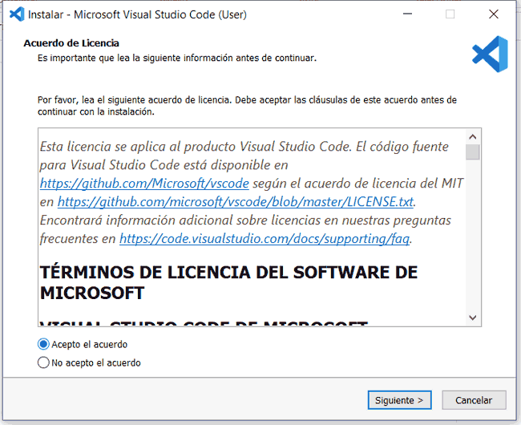
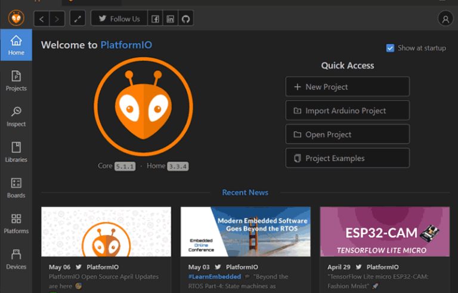
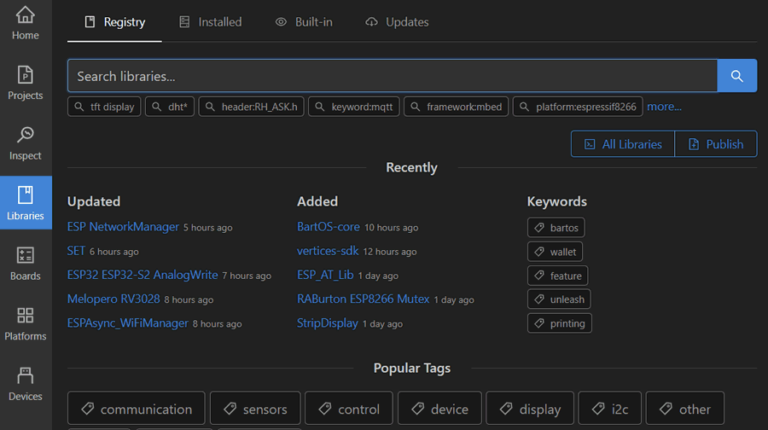
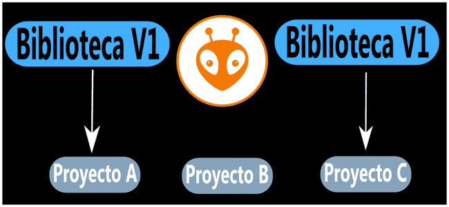
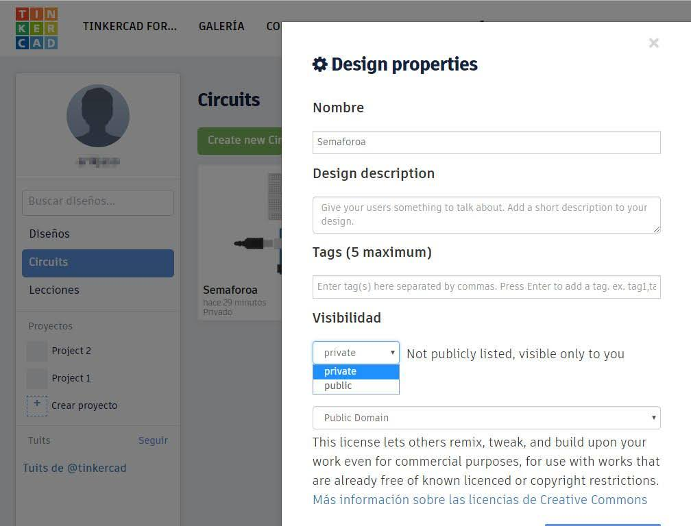
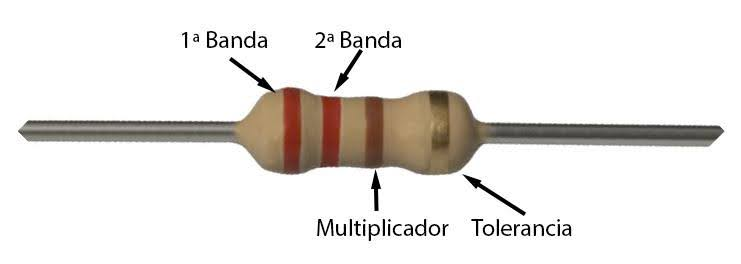

[Inicio](./index.html)

[Definiciones y conceptos generales](./01_def_y_conceptos.html).

[Desarrollo de circuitos](./02_desarrollo_de_circuitos.html)

[Sección circuitos con Arduino](./02a_arduino.html)

[Sección circuitos con ESP32](./02b_esp32.html)

# Temas complementarios

## Cómo instalar Arduino IDE?

Para instalar este IDE en tu windows seguí los siguientes pasos:

* Descargar el programa gratuito "Arduino IDE" de su propia página web.

* Instalación en Windows: (si tu sistema operativo es Linux podés saltar al siguiente punto). Una vez descargado lo ejecutás y podés ver la siguiente ventana.

* Pulsamos en **_I Agree_**. En este cuadro dejamos todas las opciones marcadas, pero hay que prestar especial atención a la opción de instalar los USB driver, ya que esto es muy importante para que la placa Arduino se pueda comunicar con la PC. 

* Pulsamos en Next e Install.

## Cómo instalar Visual Studio Code y Platformio IDE?

* Para comenzar con la instalación, debes ingresar a la página oficial de Visual Studio Code

* En el botón “Download for Windows” puedes descargar la versión estable y actualizada del software.

* Una vez descargado, haz clic en el ejecutable con el siguiente diseño, para iniciar el asistente de instalación.

* Acepta los términos y haz clic en siguiente.

* Elige la ruta donde deseas guardar el programa. Una vez terminado, haz clic en siguiente.

* Aquí puedes seleccionar la ubicación del acceso directo del programa. Por defecto, creará el acceso directo en el menú de inicio. Algo muy importante, es dejar marcada la casilla «Agregar a PATH» en el cuadro de diálogo. También tienes otras opciones.

* El resto de opciones las puedes elegir a tú gusto. Una vez terminado haz click en siguiente.

* Ten en cuenta que la instalación puede tardar un tiempo.

* Una vez finalizado el proceso, puedes verificar si el editor inicia correctamente dando click en finalizar. Aunque aún faltan detalles.

* El siguiente paso es instalar Python, para ello puede ingresar a su página oficial. En la columna de _Descargas_ (“Downloads”), puedes encontrar un botón con las versiones de Python para Windows.

* Al momento de realizar este sitio, la última versión de Python estable es: Python 3.9.5

* En el próximo paso, debes presionar en _Download Windows installer (64-bit)_ para obtener el ejecutable.
* En el próximo paso, debes ejecutar el asistente de instalación y presionar **_Install Now_** para iniciar. Pero antes, selecciona la casilla **_Add Python x.x to PATH_**. Es esencial para que _PlatformIO_ funcione correctamente.

* Espera un momento, hasta que termine el proceso.

* Luego de finalizado, puedes cerrar la ventana.

* Ahora si, todo está listo para agregar la extensión de PlatformIO a Visual Studio Code. Al iniciar **_Visual Studio Code_**, verás la siguiente pantalla.

* El próximo paso, es seleccionar el icono de extensiones (lateral izquierdo con forma de cubos). En el debes escribir _PlatformIO_ y seleccionar la primera opción. Luego, presiona **_Install_** y espera un momento.

* Es probable que notes un problema como el de la siguiente imagen. No te preocupes hay solución. Presiona, **_Check available solutions_**.

* Luego, presiona _Open_.

* El botón enlaza a una página con varias opciones para solucionar tu problema. En el artículo solo se efectúa la primera solución, si no te funciona, puedes probar las demás.

* Ve al icono de Windows. Después elige **_Aplicaciones y características_**.

* Elegí la opción: **_Alias de ejecución de aplicaciones_**.

* Desactiva el instalador de aplicaciones: **_python.exe_** y **_python3.exe_**.

* Luego de solucionar el error, el proceso de instalación continúa automáticamente. Una vez terminado, debes reiniciar _Visual Studio Code_.

### Conceptos básicos de PlatformIO

Para empezar a entender las herramientas de PlatformIO y como está organizado, se da un repaso a la pantalla de bienvenida de la extensión PlatformIO.

#### Sección pestaña de bienvenida PlatfotmIO IDE

En el inicio del complemento puedes:

* Verificar la versión instalada.
* Crear, importar y abrir proyectos.
* También puedes ver ejemplos.

#### Proyectos en PlatformIO

En la grilla izquierda, también se encuentra una lista con todos los proyectos creados donde puedes editar cada uno y agregar descripciones.

#### Sección inspeccionar en PlatformIO

Aquí puedes inspeccionar tus proyectos en busca de estadísticas de uso de memoria.

#### Sección librerías en PlatformIO

Aquí verás el gestor de librerías, este nos ayuda a incluir librerías de forma global o privada.

#### Placas en PlatformIO

Por aquí se puede buscar e instalar el driver para la placa que utilices.

#### Sección plataformas en PlatformIO

Aquí se enumeran las plataformas usadas hasta el momento como, **_ArduinoAVR_**, **_Espressif ESP32_**, **_Espressif 8266_** y otras.

#### Dispositivos en PlatformIO

Aquí puedes ver una lista de las placas conectadas actualmente a tu PC. Se crea automáticamente, y gracias a esto, no es necesario seleccionar el puerto, a diferencia del IDE de Arduino.

## Gestión de librerías

### Gestión de librerías en Arduino IDE

Dentro de Arduino IDE podés encontrar el gestor de librerías con infinidad de librerías. Desde ahí se puede instalar la que necesites. Cada librería instalada en Arduino IDE está disponible para todos los proyectos (sketch) que desarrolles. Por ejemplo, si instalas la versión 2.0 de una pantalla LCD, entonces todos los proyectos tendrán acceso a esa versión.

De modo que si se cambia la versión, lo hará en todos los proyectos.

Esta manera de gestionar librerías, facilita enormemente el uso del IDE Arduino para principiantes, pero cuando se trata de proyectos más elaborados, se vuelve un tanto engorroso.

* Si trabajas con librerías que compartan un mismo nombre no se puede usar a menos que elimines la original.
* Un cambio de la versión de una librería puede ocasionar errores en uno de los proyectos.
* La portabilidad de tu código, se limita. Debes recordar llevar una copia de seguridad de tus librerías.

### Gestión de librerías en PlatformIO

La gran diferencia con Arduino IDE es que Platformio te permite instalar las librerías por cada proyecto. Por ejemplo, aquí tienes 3 proyectos, el **_A_** y el **_C_** usan la versión 1 de una librería genérica, mientras que el **_B_** no la necesita.

En el segundo caso ficticio, se agregaron algunas funcionalidades en el proyecto **__B_**, por lo tanto, hizo falta añadirle la versión 1 de la librería.

Por otro lado, actualizamos la librería a su versión 2 para el proyecto **_A_** y para evitar errores en el proyecto **_B_** y **_C_** se decidió no actualizar la librería.

Como puedes ver _PlatformIO_ proporciona una gran ventaja. Ahora verás un ejemplo real. En la sección librerías ingresa la palabra servo, verás que arroja bastantes resultados. Te puedes guiar por la cantidad de descargas para elegir la adecuada.

Hace click en alguna y encontrarás estos apartados:

* El ejemplo básico que puedes utilizar.
* Acá puedes encontrar las dependencias que debes indicar en _platformio.ini_ (aunque no es necesario con el gestor de librerías de _PlatformIO_). Por otro lado, las dependencias señalan cuál es la librería y la versión que se necesita instalar.
* Headers, es la forma que debes declarar la librería en tu código principal.
* Changelog, cuenta las novedades de la librería.
* Ahora toca agregar la librería a tu proyecto.

Luego elige tu proyecto y haz clic en agregar. Verás como se descarga, instala y configura automáticamente, gracias al administrador de PlatformIO.

## Tinkercad

**_Tinkercad_** es una herramienta online ofrecida por la firma _Autodesk_. Se utiliza de forma gratuita y sólo requiere crearse una cuenta de usuario. De entre sus utilidades, probablemente la más conocida es la de diseñar piezas en 3D. Sin embargo, ofrece también una posibilidad realmente interesante y es la de montar, programar y simular circuitos con Arduino.

### ¿CÓMO ARMO UN CIRCUITO EN TINKERCAD?

Para ello, deberemos crearnos una cuenta de usuario y acceder. Seleccionando la opción “Circuits” podremos empezar a crear nuestros circuitos clickeando sobre **_Create new Circuit_**.

Tinkercad asignará a nuestro nuevo proyecto un nombre por defecto (Incredible Jaban-Curcan, en la imagen) y ofrece una serie de componentes en la parte derecha de la pantalla.

El cuadro de selección nos ofrece las opciones **_Basic_** y **_All_**, según queramos componentes elementales o de uso más común como pulsadores, LEDs, resistencias fijas, potenciómetros, baterías, transistores, placas de prototipado etc. u opciones más avanzadas como circuitos integrados, osciloscopios, control remoto o tiras de LEDs.

Sea cual sea la opción, clickeando sobre el componente y arrastrándolo al área de trabajo podremos ir ensamblando nuestros circuitos. Además, podremos nombrar cada componente y cambiar ciertas características, tales como valores, color etc.

### ¿CÓMO PROGRAMO ARDUINO EN TINKERCAD?

Una vez montado el circuito con una placa controladora Arduino, podremos escribir el código. Para ello, habrá que clickear sobre el icono **_Code_** y se optará por la opción de programación por bloques, texto o mixta. Ésta última muestra las dos opciones (bloques y texto) simultáneamente.

Escribimos el programa para la placa controladora (en la imagen, un semáforo sencillo) y a continuación podemos simular el circuito eligiendo la opción **_Start Simulation_**. Tinkercad ofrece también la opción de descargarse la programación, incluir librerías en el programa y la opción debugger o depurador.

También existe la opción **_Serial Monitor_** para poder escribir instrucciones o leer valores.

Por último, podremos asignar a nuestro proyecto una serie de propiedades si clickeamos en su vértice superior derecho (rueda dentada -> **_Options_**).

Además de asignarle un nombre, una descripción y hasta cinco etiquetas, podremos hacerlo público para que otros/as usuarios/as de Tinkercad puedan tener acceso a nuestro diseño, así como asignarle una licencia según los estándares _Creative Commons_.

Estos mismos proyectos creados por la comunidad de usuarios y usuarias de Tinkercad son los que se pueden consultar, copiar y modificar (según licencia) accediendo a través de _Galería_.

## Driver para chip CP2109 link

La placa ESP32 trae un 2do chip en la placa encargado de gestionar la comunicación serial entre la PC y el ESP32. Comunmente este chip es conocido con el código **_CP2109_**. Para que nuestra PC detecte la placa al conectarla mediante USB, necesitamos instalar el driver correspondiente. Entraremos al siguiente enlaces y descararemos la opción que corresponda a nuestro sistema operativo: [https://www.silabs.com/developers/usb-to-uart-bridge-vcp-drivers] (https://www.silabs.com/developers/usb-to-uart-bridge-vcp-drivers)

Descomprimimos el archivo que nos descargo y enseguida ejecutamos el siguiente archivo y seguimos el proceso de instalacion.

Si el driver se instalo correctamente veremos en el administrador de dispositivos el puerto COM

## Resistencias

Se denomina resistencia eléctrica a la igualdad de oposición que tienen los electrones al desplazarse a través de un conductor. La unidad de resistencia en el Sistema Internacional es el ohmio, que se representa con la letra griega omega, en honor al físico alemán Georg Ohm, quien descubrió el principio que ahora lleva su nombre. En la siguiente imagen podemos ver los símbolos que son normalmente utilizados para identificar las resistencias fijas en esquemas eléctricos.

El rango de valores que pueden tener las resistencias es enorme, pueden ir desde unos pocos ohmios hasta millones de ohmios. Para representar el valor de las resistencias en los esquemas se usan simplificaciones del tipo 4K7Ω (Kilo-Ohmios) o 2MΩ (Mega-Ohmios), los "Kilo-Ohmios" añaden un factor de multiplicación de 1000 y los "Mega-Ohmios" de 1.000.000, por lo que los valores anteriores corresponderían a 4.700Ω (4K7Ω) y 2.000.000Ω (2MΩ). Pero... ¿cómo se indica el valor que tiene una resistencia en la propia resistencia? Esto se hace con el "código de colores".

## EL CÓDIGO DE COLORES

El código de colores de las resistencias se desarrolló como una manera sencilla de transmitir tanto el valor que posee la resistencia en ohmios como su tolerancia, debido a que por el pequeño tamaño de este elemento si se hiciera mediante cifras toda esta información sería en muchos casos ilegible.

Para caracterizar una resistencia eléctrica necesitaremos normalmente 4 bandas de colores, las dos primeras nos indicaran las dos primeras cifras de la resistencia, la tercera será el multiplicador y la cuarta (que estará algo más separada de las otras) será la que nos indique la tolerancia de la resistencia.

Para leer el valor de la resistencia, colocamos la banda de la tolerancia a la derecha y empezamos a leer de izquierda a derecha, la primera banda que nos encontramos representará las decenas, la segunda serán las unidades y la tercera el factor por el que multiplicaremos las dos cifras anteriores. 

En el ejemplo de arriba, podemos ver (Rojo, Rojo, Marrón, Oro).

Primera Banda (Rojo) = 2
Segunda Banda (Rojo) = 2
Tercera Banda (Marrón) = Multiplicador x10
Cuarta Banda (oro) = Tolerancia 5%

Esto nos dará: 22 x 10 = 220Ω con una tolerancia del 5% (la resistencia tendrá un valor real de 209 a 231Ω)

## Diodos

El diodo es un componente electrónico de 2 terminales, tal como un resistor.

Un diodo es un dispositivo diseñado para que la corriente fluya en un solo sentido, es decir, solamente permite que la corriente vaya en una sola dirección. El símbolo representativo del diodo en esquemas electrónicos es el siguiente:

La corriente fluye desde el terminal positivo (el ánodo) hasta el terminal negativo (cátodo).

En los diodos físicos se identifica el cátodo por una franja que se coloca en uno de los extremos del diodo. Los diodos tienen una gran cantidad de usos. Su principal función es impedir que la corriente fluya en 2 sentidos.

## Pulsadores

Un botón o pulsador es un dispositivo utilizado para realizar cierta función. Los botones son de diversas formas y tamaños y se encuentran en todo tipo de dispositivos, aunque principalmente en aparatos eléctricos y electrónicos. Los botones son por lo general activados, al ser pulsados con un dedo. Permiten el flujo de corriente mientras son accionados. Cuando ya no se presiona sobre él vuelve a su posición de reposo. Puede ser un contacto normalmente abierto en reposo NA o NO (Normally Open en inglés), o con un contacto normalmente cerrado en reposo NC.

Cuando nos desenvolvemos en el entorno de Arduino, nos encontramos con un término poco común: la polarización de una E/S. Debemos saber que hay dos tipos de polarización: 

* Polarización alta, donde la resistencia (término inglés Pullup) va conectada a 5V.
* Polarización baja, donde la resistencia (término inglés Pulldown) va conectada a masa 0V.

Siguen dos esquemas de estos términos:

Cuando conectamos un pulsador a una entrada de un Arduino, debemos polarizar la entrada para no recibir ruido.

Al trabajar con botones nos vamos a encontrar con el problema de los rebotes o bouncing. La solución pasa por leer el estado del botón cuando se produce el borde ascendente de la tensión a extremos de los contactos del pulsador e introducir inmediatamente la salida con ese estado, el resto de entradas (se llama ruido) se inhiben o anulan mediante un lapsus de tiempo. En la siguiente imagen se podrá observar lo dicho:

Para solucionar el problema de los rebotes podemos hacerlo vía hardware o software:

* **_Hardware_**: aquí se pueden utilizar diferentes técnicas, pero la más común es utilizar un condensador conectado en paralelo al pulsador. El condensador tardará cierto tiempo en cargarse y una vez que esté cargado, la señal de salida será igual a la señal de entrada.

* **_Software_**: puede utilizarse solamente cuando tratemos la señal con un procesador, es decir, cuando hay algún programa que lea la señal emitida por el pulsador. La técnica más utilizada consiste en ignorar las conmutaciones del valor del sensor si desde la última conmutación válida no ha pasado suficiente tiempo.

## Protoboard o placa de prueba

Una protoboard, o breadboard, es prácticamente una PCB temporal con una forma y tamaño generalizados. Utilizada comúnmente para pruebas y prototipos temporales de  circuitos. Se usa insertando las terminales de los dispositivos electrónicos en los orificios de la protoboard de forma tal que tengan continuidad.

Una protoboard debe usarse meramente para hacer pruebas y prototipos temporales. Dado que, aunque se pueden diseñar una infinidad de circuitos en ellas, estos circuitos no pueden ser muy grandes debido a su espacio limitado. Sin embargo, varias protoboard se pueden unir si es que sus puntos de ensamblaje coinciden.

Comúnmente tienen 830 puntos de conexión divididos en dos segmentos. Uno de 63 líneas con cinco puntos de conexión cada una y cuatro líneas, a los extremos, de 25 puntos de conexión para la alimentación de voltaje y tierra del circuito. Esta protoboard o breadboard es muy útil para probar circuitos grandes o medianos.

En algunas protoboard las líneas de alimentación se cortan a la mitad, para dar continuidad. Simplemente se tienen que unir estas dos mitades con un pequeño cable. Si aún así no tienen continuidad, esto podría significar que tu protoboard está defectuoso.

Las protoboard están divididas en dos segmentos con varias líneas de conexión. Estas constan de cinco puntos de conexión cada una. Para revisar la continuidad entre estos cinco puntos de conexión se puede usar nuevamente el multímetro.

Las protoboard están dividas en dos segmentos, los cuales están señalizados con letras, de la letra “a” a la letra “e” para el primer segmento, y de la letra “f” a la letra “j” para el segundo segmento. Estas señalizaciones no se encuentran en las protoboards chicas, pero sus dos segmentos están divididos de la misma forma. Estos segmentos tienen números a los lados, los cuales van de cinco en cinco hasta el número 60 para las protoboards grandes, y de uno en uno hasta el número 30 para las protoboards medianas. Algunas de las protoboards chicas no tienen números, pero las conexiones se realizan de la misma forma.

Las conexiones en las protoboards se deben de realizar de una forma específica. Los puntos de conexión están unidos por una línea horizontal. Si queres conectar algún componente y te posicionas en la fila “1” y en la columna “a” todos los puntos de conexión que están en la fila “1” del segmento “abcde” estarían haciendo contacto con la terminal de tu componente, mientras que ninguno de los puntos de conexión de la columna “a” lo están. Así que la continuidad de los puntos de conexión se revisa en las filas, y no en las columnas. Esto se debe hacer en ambos segmentos de la protoboard.

## Cables dupont

Un cable dupont para prototipos, es un cable con un conector en cada punta, que se usa normalmente para interconectar entre sí los componentes en una placa de pruebas. Se utilizan de forma general para transferir señales eléctricas de cualquier parte de la placa de prototipos.

* * *
* * *
[Ir al Desarrollo de circuitos](./02_desarrollo_de_circuitos.html)

[Ir al inicio](./index.html)