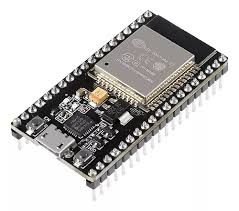

#**Bienvenidos al curso!**

Este sitio tiene como objetivo complementar las clases presenciales del curso. La idea es que sea un material de apoyo y consulta constante, tanto durante como después del curso. Antes de empezar, les recomiendo leer este fragmento.

El curso busca que aprendan a desarrollar y a diseñar circuitos con [sistemas embebidos](https://www.youtube.com/watch?app=desktop&v=dFu4t5yGKfI) a partir de los siguientes elementos:

* Una placa de desarrollo: Arduino o *ESP32*.
* Un entorno de desarrollo: *Arduino IDE* o *Visual Studio Code*.
* Diversos componentes electrónicos.



Aprendiendo a dominar estas herramientas, van a poder terminar el curso cumpliendo los siguientes objetivos:
* Entender código, modificar código ya escrito y desarrollar código nuevo en Arduino IDE y en Visual Studio Code.
* Armar un circuito físico con electrónica y ESP32.
* Idear un proyecto de principio a fin con el siguiente esquema:
  * Proponer una solución a un problema planteado.
  * Plasmar esa propuesta de solución en un diagrama en bloques.
  * Escribir el código que necesita la solución.
  * Armar el circuito que necesita la solución.

##¿Qué necesitamos para empezar a llegar a los objetivos?
* Comenzar a planear proyectos escribiendo en palabras el problema y la solución propuesta.
* Conocer qué es y cómo armar un diagrama en bloques.
* Aprender a escribir código en Arduino IDE o en Visual Studio Code.

##¿Y a partir de lo anterior, ¿cómo seguimos?
* No podemos sumarle cosas a nuestra placa de desarrollo si antes no conocemos que tiene por dentro, cómo controlamos eso y cómo lo programamos estando solo en un circuito.
* Para saber que tiene dentro y como usamos eso, necesitamos saber programar.
* Sabiendo programar , empezamos a sumar cosas a la placa con la que estemos trabajando (en nuestro caso, Arduino o ESP32).
  * Primero: resistencias, LED’s y botones.
  * Segundo: buzzers.
  * Tercero: módulos infrarrojos, de ultrasonido, pantallas LCD.
  * Cuarto: displays, demás cosas.

Si ya leyeron hasta acá, les resultó interesante y están motivados, sigamos adelante. Si por el contrario, no les pareció atractivo y no los motivó, les recomiendo que no sigan.
Lo último antes de arrancar. Es condición necesaria que antes de empezar cumplan con estos requisitos:

* Manejar una PC: elemental para desenvolverte bien con la programación y el simulador Tinkercad.
* Una dirección de correo electrónico: para que recibas apuntes, información importante y puedas abrir tu cuenta de Tinkercad.
* Conocimientos básicos de electrónica como, por ejemplo, Ley de Ohm, Leyes de Kirchoff, código de resistencias y parámetros eléctricos básicos como corriente, tensión, resistencia, potencia, etc. Si no tienen estos conocimientos, les recomiendo que los adquieran antes de empezar el curso. Esto hará que aprovechen muchísimo más el contenido que van a conocer.

Si nada de lo que leyeron hasta acá los invitó a dejar el curso, vamos para adelante!


Text can be **bold**, _italic_, or ~~strikethrough~~.

[Link to another page](./another-page.html).

There should be whitespace between paragraphs.

There should be whitespace between paragraphs. We recommend including a README, or a file with information about your project.

# Introducción

This is a normal paragraph following a header. GitHub is a code hosting platform for version control and collaboration. It lets you and others work together on projects from anywhere.

## Header 2

> This is a blockquote following a header.
>
> When something is important enough, you do it even if the odds are not in your favor.

### Header 3

```js
// Javascript code with syntax highlighting.
var fun = function lang(l) {
  dateformat.i18n = require('./lang/' + l)
  return true;
}
```

```ruby
# Ruby code with syntax highlighting
GitHubPages::Dependencies.gems.each do |gem, version|
  s.add_dependency(gem, "= #{version}")
end
```

#### Header 4

*   This is an unordered list following a header.
*   This is an unordered list following a header.
*   This is an unordered list following a header.

##### Header 5

1.  This is an ordered list following a header.
2.  This is an ordered list following a header.
3.  This is an ordered list following a header.

###### Header 6

| head1        | head two          | three |
|:-------------|:------------------|:------|
| ok           | good swedish fish | nice  |
| out of stock | good and plenty   | nice  |
| ok           | good `oreos`      | hmm   |
| ok           | good `zoute` drop | yumm  |

### There's a horizontal rule below this.

* * *

### Here is an unordered list:

*   Item foo
*   Item bar
*   Item baz
*   Item zip

### And an ordered list:

1.  Item one
1.  Item two
1.  Item three
1.  Item four

### And a nested list:

- level 1 item
  - level 2 item
  - level 2 item
    - level 3 item
    - level 3 item
- level 1 item
  - level 2 item
  - level 2 item
  - level 2 item
- level 1 item
  - level 2 item
  - level 2 item
- level 1 item

### Small image


### Large image


### Definition lists can be used with HTML syntax.

<dl>
<dt>Name</dt>
<dd>Godzilla</dd>
<dt>Born</dt>
<dd>1952</dd>
<dt>Birthplace</dt>
<dd>Japan</dd>
<dt>Color</dt>
<dd>Green</dd>
</dl>

```
Long, single-line code blocks should not wrap. They should horizontally scroll if they are too long. This line should be long enough to demonstrate this.
```

```
The final element.
```
