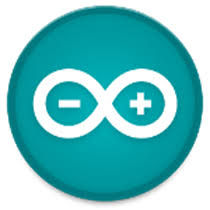
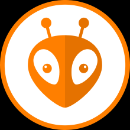
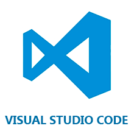
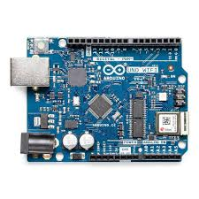

#**Bienvenidos al curso!**

Este sitio tiene como objetivo complementar las clases presenciales del curso. La idea es que sea un material de apoyo y consulta constante, tanto durante como después del curso. Antes de empezar, les recomiendo leer este fragmento.

El curso busca que aprendan a desarrollar y a diseñar circuitos con [sistemas embebidos](https://www.youtube.com/watch?app=desktop&v=dFu4t5yGKfI) a partir de los siguientes elementos:

* Una placa de desarrollo: Arduino o *ESP32*.
* Un entorno de desarrollo: *Arduino IDE* o *Visual Studio Code*.
* Diversos componentes electrónicos.

Aprendiendo a dominar estas herramientas, van a poder terminar el curso cumpliendo los siguientes objetivos:
* Entender código, modificar código ya escrito y desarrollar código nuevo en Arduino IDE y en Visual Studio Code.
* Armar un circuito físico con electrónica y ESP32.
* Idear un proyecto de principio a fin con el siguiente esquema:
  * Proponer una solución a un problema planteado.
  * Plasmar esa propuesta de solución en un diagrama en bloques.
  * Escribir el código que necesita la solución.
  * Armar el circuito que necesita la solución.

##¿Qué necesitamos para empezar a llegar a los objetivos?
* Comenzar a planear proyectos escribiendo en palabras el problema y la solución propuesta.
* Conocer qué es y cómo armar un diagrama en bloques.
* Aprender a escribir código en Arduino IDE o en Visual Studio Code.

##¿Y a partir de lo anterior, ¿cómo seguimos?
* No podemos sumarle cosas a nuestra placa de desarrollo si antes no conocemos que tiene por dentro, cómo controlamos eso y cómo lo programamos estando solo en un circuito.
* Para saber que tiene dentro y como usamos eso, necesitamos saber programar.
* Sabiendo programar , empezamos a sumar cosas a la placa con la que estemos trabajando (en nuestro caso, Arduino o ESP32).
  * **Primero**: resistencias, LED’s y botones.
  * **Segundo**: buzzers.
  * **Tercero**: módulos infrarrojos, de ultrasonido, pantallas LCD.
  * **Cuarto**: displays, demás cosas.

Si ya leyeron hasta acá, les resultó interesante y están motivados, sigamos adelante. Si por el contrario, no les pareció atractivo y no los motivó, les recomiendo que no sigan.
Lo último antes de arrancar. Es condición necesaria que antes de empezar cumplan con estos requisitos:

* _Manejar una PC_: elemental para desenvolverte bien con la programación y el simulador Tinkercad.
* _Una dirección de correo electrónico_: para que recibas apuntes, información importante y puedas abrir tu cuenta de Tinkercad.
* _Conocimientos básicos de electrónica_: Ley de Ohm, Leyes de Kirchoff, código de resistencias y parámetros eléctricos básicos como corriente, tensión, resistencia, potencia, etc. Si no tienen estos conocimientos, les recomiendo que los adquieran antes de empezar el curso. Esto hará que aprovechen muchísimo más el contenido que van a conocer.

Si nada de lo que leyeron hasta acá los invitó a dejar el curso, vamos para adelante!

Arranquemos viendo [Definiciones y conceptos generales](./01_def_y_conceptos.html).